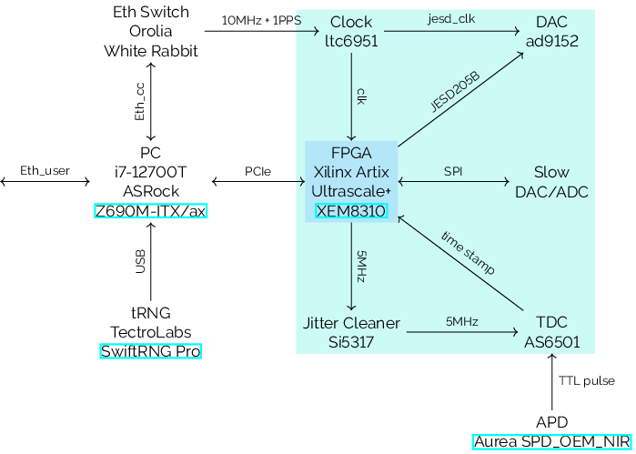

# Electronics

## Amplifiers

## Bias

## Power meters

## Customized camputer
Customized camputer from [Sedatech](https://www.sedatech.net/)
- Processor:  Intel i7-14700T
- RAM: 16Gb DDR5-5200
- Graphic card: Intel UHD Graphics 770
- Mother board: Asrock Z790M-ITX/Wifi
- SSD: 500Go NVMe
- Aircooling: Jonsbo HX4170D
- Power supply: 150W External power supply

