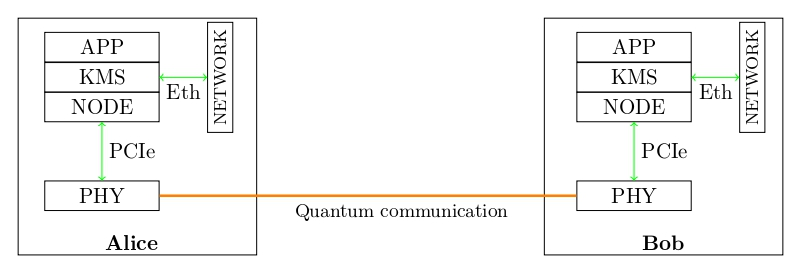
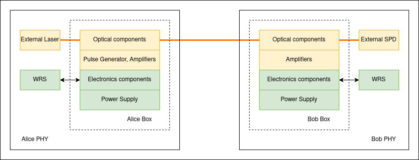
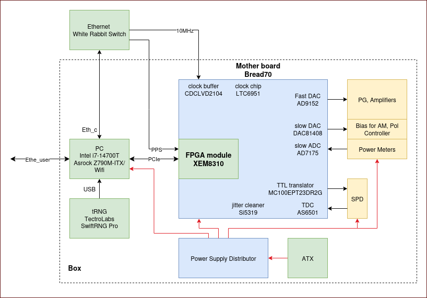

# Electronics

Remind you this is overview of our open-source QKD system

PHY layer is in charge of generating the keys. Then keys are passed to Node. So PHY layer includes:
- Physical hardware
- Device driver and Control API
## Physical hardware

This is an overview of physical hardware. There are 2 groups of components:
- Optics: Laser, Laser Driver, Pulse Generator, Amplifiers, Single Photon Detector, other optical components. The detail of each components and physical connections are explained in Optics chapter
- Electronics: White Rabbit Switch (WRS), Power Supply system, and other electronics components. The picture below shows the system of electronics, electrical power supply and interface with Optics.

## Device driver and Control API
To complete the PHY layer, it requires a software layer to control the physical hardware. It includes:
- Device driver: this is the low-level software handles PCIe communication (using XDMA) between PC and FPGA. It operates at OS kernel level and written by Xilinx
- Control API: this is the high-level software runs at user level to configure, control FPGA via the device driver. User sends commands, data to FPGA on from this API
 
Instructions to install the driver and source code of Control API is available in [kiwi_hw_control](https://github.com/Veriqloud/kiwi_hw_control/tree/master) github repos

## Sub-Chapters
- PCB board design: describes the Motherboard Bread70, Power Supply Distributors, ATX, Power Meters, and future PCB designs
- FPGA programming: describes logic design in FPGA and corresponding Control API 
- WRS, Computer, tRNG: details of these components

