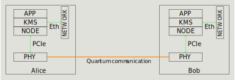

# Electronics

As reminder, here is the logical overview of the system

The physical layer (PHY) is in charge of generating the raw keys, which are then passed to Node. The PHY layer includes:
- Physical hardware
- Device driver and Control API

## Physical hardware

This is an overview of the physical hardware. There are 2 groups of components:
- Optics and their drivers: Laser, Laser Driver, Pulse Generator, Amplifiers, Single Photon Detector, other optical components. The detail of each components and physical connections are explained in Optics chapter
- Electronics: White Rabbit Switch (WRS), Power Supply system, digital to analog converters (DA) and other electronics components. 

The picture below shows the system of electronics, electrical power supply and interface with Optics.

Some abbreviations: Pulse Generator (PG), Amplitude Modulator (AM), Single Photon Detector (SPD), true Randon Number Generator (tRNG), Personal Computer (PC), Time to Digital Converter (TDC), Digital to Analog Converter (DAC)

## Device driver and Control API
To complete the PHY layer, it requires a software layer to control the physical hardware. It includes:
- Device driver: this is the low-level software handles PCIe communication (using XDMA) between PC and FPGA. It operates at OS kernel level and is written by Arm (Xilinx)
- Control API: this is the high-level software that runs at user level to configure and control the FPGA via the device driver. The user sends commands and data to FPGA from this API
 
Instructions to install the driver and source code of Control API is available in [kiwi_hw_control](https://github.com/Veriqloud/kiwi_hw_control/tree/master) github repos. Os level documentation is also provided in the User Guide section.

## Sub-Chapters
- PCB board design: describes the Motherboard Bread70, Power Supply Distributors, ATX, Power Meters, and future PCB designs
- FPGA programming: describes logic design in FPGA and corresponding Control API 
- WRS, Computer, tRNG: details of these components

