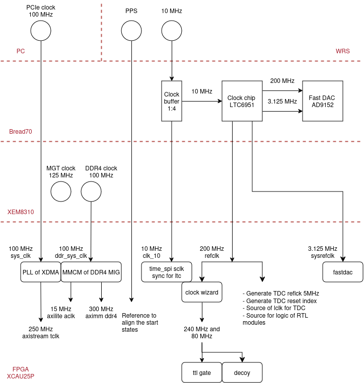
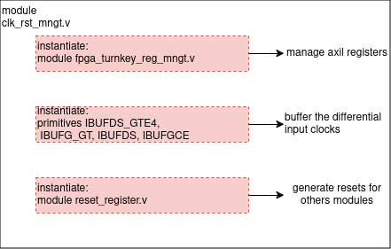

# Clock and reset management

## Clock tree
This is an overview of the clock distribution for Kiwi device. There are 3 clock sources:
- Source 100 MHz for PCIe comes from mother board of PC
- Source 100 MHz for DDR4 comes from oscilator on XEM8310 modules
- Source 10 MHz and PPS comes from White Rabbit Switch(WRS)

WRS 10 MHz is reference for PLL LTC6951 to generate clock pairs (sysref 3.125 MHz and refclk 200 MHz) for Fast DAC AD9152 and FPGA. PLL LTC6951 requires a SYNC signal to align all outputs to input, I use WRS PPS and 10 MHz to generate this signal, then the outputs will be aligned to PPS.

reflck 200 MHz is is the source clock for all logics in fpga, PPS is reference for synchronization       



## Module RTL
Purpose of this module:
- Manage the input clocks
- Generate the resets for other RTL modules
- Generate SYNC signal for clockchip on board Bread70



Axilite registers:

|signal		      |register name                  			|axil register| offset address (dec) |
|-----------------|-----------------------------------------|-------------|---------|
|clockchip_sync 			|clockchip_sync_o				|slv_reg0[0]|0
|fpga_turnkey_fastdac_rst   |fpga_turnkey_fastdac_rst_o		|slv_reg0[1]|0
|tdc_rst   					|tdc_rst_o						|slv_reg1[0]|4
|gc_rst						|gc_rst_o						|slv_reg2[0]|8
|ttl_rst					|ttl_rst_o						|slv_reg3[0]|12
|lrst_i						|lrst_o	 						|slv_reg1[1]|4
|ddr_data_rst				|ddr_data_rst_o					|slv_reg4[0]|16

Generate SYNC signal for clockchip: after receiving command from OS through clockchip_sync, detect rising edge of PPS and start counting to generate a 2ms pulse for clockchip (minimum is 1ms)
```   
reg sync_ltc_o;
reg [2:0] clockchip_sync_r;
reg [15:0] counter_clk;

reg pps_clk_r;
reg pps_clk_trigger;
initial begin
    pps_clk_r <= 0;
    clockchip_sync_r <= 3'b0;
end


always @(posedge clk10_o or negedge sys_reset_n) begin
   if (!sys_reset_n) begin
      clockchip_sync_r <= 0;
      sync_ltc_o <= 0;

      pps_clk_trigger <= 0;
      pps_clk_r = 0;

      counter_clk <= 0;
   end else begin
      clockchip_sync_r <= {clockchip_sync_r[1:0],clockchip_sync};
      pps_clk_r <= pps_i;
      //Detect rising edge of pps after receive the sync command from OS
      if ((!pps_clk_r && pps_i) && clockchip_sync_r[2]) begin
         pps_clk_trigger <= 1;
      end
      if (pps_clk_trigger) begin
         counter_clk <= counter_clk + 1;
         if ((counter_clk > 0) && (counter_clk <= 16'd20000)) begin //20000 = 2ms for sync pulse
            sync_ltc_o <= 1'b1;
         end else if (counter_clk > 16'd20000) begin
            counter_clk <= counter_clk;
            sync_ltc_o <= 1'b0;
         end else begin
            sync_ltc_o <= 1'b0;
         end
      end else begin
         sync_ltc_o <= 1'b0;
         counter_clk <= 0;
      end

   end
end

```