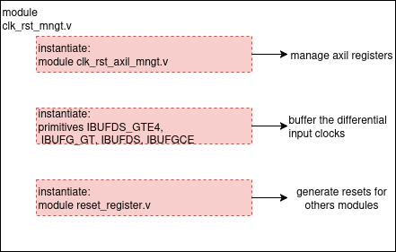

# Clock and reset management

## Clock tree
This is an overview of the clock distribution for Kiwi device. There are 3 clock sources:
- Source 100 MHz for PCIe comes from mother board of PC
- Source 100 MHz for DDR4 comes from oscilator on XEM8310 modules
- Source 10 MHz and PPS comes from White Rabbit Switch(WRS)

WRS 10 MHz is reference for PLL LTC6951 to generate clock pairs (sysref 3.125 MHz and refclk 200 MHz) for Fast DAC AD9152 and FPGA. PLL LTC6951 requires a SYNC signal to align all outputs to input, I use WRS PPS and 10 MHz to generate this signal, then the outputs will be aligned to PPS.

reflck 200 MHz is is the source clock for all logics in fpga, PPS is reference for synchronization       


## Module RTL
Purpose of this module:
- Manage the input clocks
- Generate the resets for other RTL modules
- Generate SYNC signal for clockchip on board Bread70



### Port descriptions
|Signals name         |Interface |Dir |Init status |Description
|---------------------|----------|----|------------|-----------
|fastdac_refclki_p/n  |cr_ext_cr |I   |200MHz      |input of jesd refclk from clockchip 
|fastdac_sysref_p     |cr_ext_cr |I   |3.125MHz    |input of jesd sysref from clockchip
|fastdac_syncout_p    |cr_ext_cr |I   |-           |input of jesd syncout from receiver 
|ext_clk10_p          |cr_ext_cr |I   |10MHz       |input of 10MHz from WRS
|ext_clk100_p         |cr_ext_cr |I   |100MHz      |input of 100MHz from clockchip 
|axil signals         |s_axil    |IO  |-           |standard axilite interface for r/w registers 
|s_axil_aclk          |Clock     |I   |15MHz       |clock for axil interface 
|sys_reset_n          |Reset     |I   |-           |system reset, active LOW
|clk_ddr_axi_i        |Clock     |I   |300MHz      |clock to generated from MMCM of DDR4 
|rst_ddr_axi_i        |Reset     |I   |-           |reset synced to clk_ddr_axi_i
|fastdac_gt_powergood_i|-        |I   |-           |powergood indicator of jesd204B core
|pps_i                |-         |I   |-           |PPS from WRS
|lclk_i               |Clock     |I   |-           |lclk domain of tdc module
|rstn_axil_o          |Reset     |O   |-           |Reset axil interface in others modules
|rstn_ddr_axi_o       |Reset     |O   |-           |Reset AXI interface of DDR4
|fastdac_refclk_o     |Clock     |O   |200MHz      |Refclk for QPLL in JESD204_PHY IP 
|fastdac_coreclk_o    |Clock     |O   |200MHz      |Clock for logic in 200MHz domain
|fastdac_corerst_o    |Reset     |O   |-           |Reset for fastdac core
|fastdac_sysref_o     |Clock     |O   |3.125MHz    |Sysref for jesd204b core 
|fastdac_syncout_o    |-         |O   |-           |syncout for jesd204b core
|clk10_o              |Clock     |O   |10MHz       |clk10 SE (single-ended)
|clk100_o             |Clock     |O   |100MHz      |clk100 SE
|sync_ltc_o           |Clock     |O   |2ms HIGH    |SYNC signal for clockchip output alignment  
|tdc_rst_o            |Reset     |O   |-           |Reset for tdc clock reset module
|lrst_o               |Reset     |O   |-           |Reset for tdc module in lclk domain
|ttl_rst              |Reset     |O   |-           |Reset for ttl_gate module
|decoy_rst            |Reset     |O   |-           |Reset for decoy module
|gc_rst_o             |Reset     |O   |-           |Reset for tdc module in clk200 domain
|ddr_data_rstn_o      |Reset     |O   |-           |Reset for ddr_data module

### User parameters
|Parameter           |Value     |Description
|--------------------|----------|------------
|C_S_Axil_Addr_Width |10        |Address width of axil interface
|C_S_Axil_Data_Width |32        |Address width of axil interface

### Axilite registers:
- Base Address: 0x0001_2000
- Offset address slv_reg(n) : 4*n
#### slv_reg0 - R/W Access - Trigger Control
|Bits|Signal name             |HW Wire       |Action/Value|Description
|----|------------------------|--------------|------------|-----------
|31:2|-                       |-             |-           |Reserved 0
|1   |clockchip_sync_o        |clockchip_sync|Pull LOW to HIGH|Send trigger to generate SYNC signal for external clockchip
|0   |fpga_turnkey_fastdac_rst_o|fpga_turnkey_fastdac_rst|Pull HIGH to LOW|Reset fastdac core, active HIGH

#### slv_reg1 - R/W Access - Trigger Control
|Bits|Signal name |HW Wire       |Action/Value|Description
|----|------------|--------------|------------|-----------
|31:2|-           |-             |-           |Reserved 0
|1   |tdc_rst_o   |tdc_rst       |Pull HIGH to LOW|Reset tdc clock management, active HIGH
|0   |lrst_o      |lrst_i        |Pull HIGH to LOW|Reset tdc module in lclk domain, active HIGH

#### slv_reg2 - R/W Access - Trigger Control
|Bits|Signal name |HW Wire       |Action/Value|Description
|----|------------|--------------|------------|-----------
|31:1|-           |-             |-           |Reserved 0
|0   |gc_rst_o    |gc_rst        |Pull HIGH to LOW|Reset tdc module in clk200 domain, active HIGH

#### slv_reg3 - R/W Access - Trigger Control
|Bits|Signal name |HW Wire       |Action/Value|Description
|----|------------|--------------|------------|-----------
|31:1|-           |-             |-           |Reserved 0
|0   |ttl_rst_o   |ttl_rst       |Pull HIGH to LOW|Reset ttl module, active HIGH

#### slv_reg4 - R/W Access - Trigger Control
|Bits|Signal name |HW Wire       |Action/Value|Description
|----|------------|--------------|------------|-----------
|31:1|-           |-             |-           |Reserved 0
|0   |ddr_data_rst|ddr_data_rst  |Pull HIGH to LOW|Reset ddr_data module, active HIGH

#### slv_reg5 - R/W Access - Trigger Control
|Bits|Signal name |HW Wire       |Action/Value|Description
|----|------------|--------------|------------|-----------
|31:1|-           |-             |-           |Reserved 0
|0   |decoy_rst_o	|decoy_rst     |Pull HIGH to LOW|Reset decoy module, active HIGH

<!-- |signal		      |register name                  			|axil register| offset address (dec) |
|-------------------------|------------------------------|-------------|---------|
|clockchip_sync 			  |clockchip_sync_o				   |slv_reg0[0]|0
|fpga_turnkey_fastdac_rst |fpga_turnkey_fastdac_rst_o		|slv_reg0[1]|0
|tdc_rst   					  |tdc_rst_o						   |slv_reg1[0]|4
|gc_rst						  |gc_rst_o						      |slv_reg2[0]|8
|ttl_rst					     |ttl_rst_o						   |slv_reg3[0]|12
|lrst_i						  |lrst_o	 						   |slv_reg1[1]|4
|ddr_data_rst             |ddr_data_rst_o					   |slv_reg4[0]|16
|decoy_rst                |decoy_rst_o					      |slv_reg5[0]|20 -->

### Generate SYNC signal for clockchip
After receiving command from OS through clockchip_sync, detect rising edge of PPS and start counting to generate a 2ms pulse for clockchip (minimum is 1ms)
```  
reg sync_ltc_o;
reg [2:0] clockchip_sync_r;
reg [15:0] counter_clk;

reg pps_clk_r;
reg pps_clk_trigger;
initial begin
    pps_clk_r <= 0;
    clockchip_sync_r <= 3'b0;
end


always @(posedge clk10_o or negedge sys_reset_n) begin
   if (!sys_reset_n) begin
      clockchip_sync_r <= 0;
      sync_ltc_o <= 0;

      pps_clk_trigger <= 0;
      pps_clk_r = 0;

      counter_clk <= 0;
   end else begin
      clockchip_sync_r <= {clockchip_sync_r[1:0],clockchip_sync};
      pps_clk_r <= pps_i;
      //Detect rising edge of pps after receive the sync command from OS
      if ((!pps_clk_r && pps_i) && clockchip_sync_r[2]) begin
         pps_clk_trigger <= 1;
      end
      if (pps_clk_trigger) begin
         counter_clk <= counter_clk + 1;
         if ((counter_clk > 0) && (counter_clk <= 16'd20000)) begin //20000 = 2ms for sync pulse
            sync_ltc_o <= 1'b1;
         end else if (counter_clk > 16'd20000) begin
            counter_clk <= counter_clk;
            sync_ltc_o <= 1'b0;
         end else begin
            sync_ltc_o <= 1'b0;
         end
      end else begin
         sync_ltc_o <= 1'b0;
         counter_clk <= 0;
      end

   end
end

```