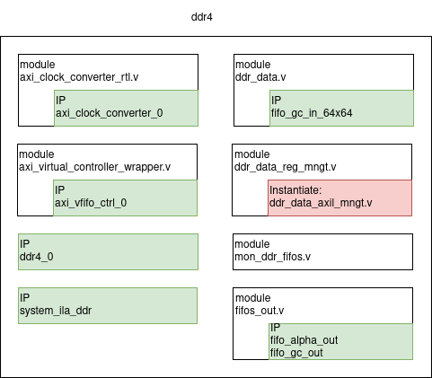
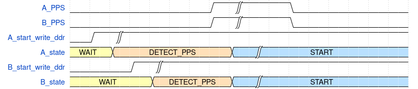
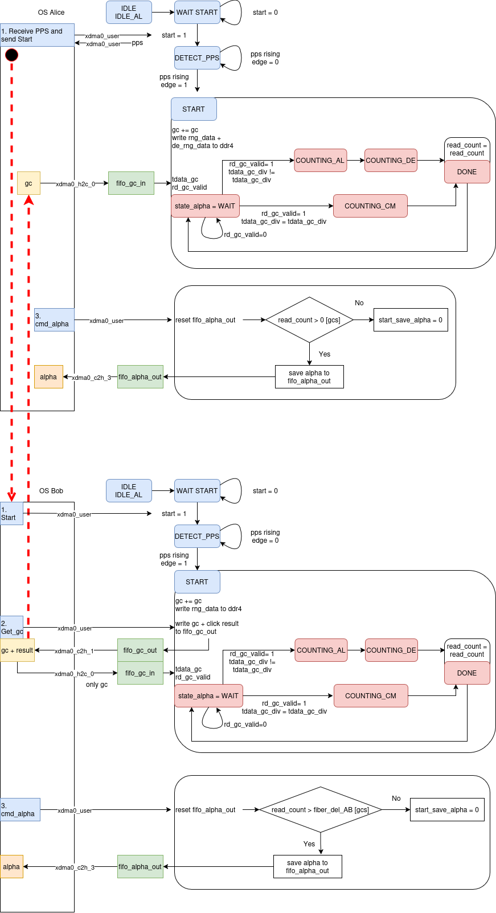
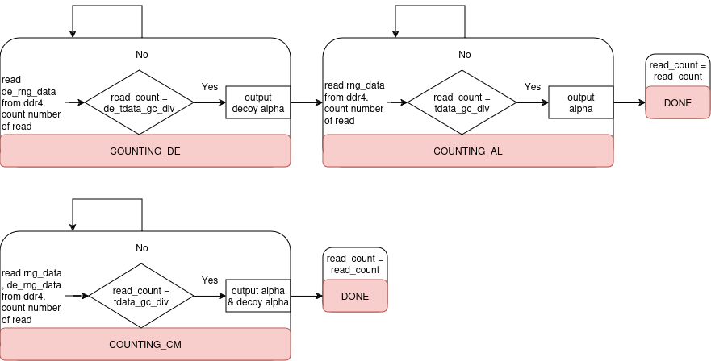

# DDR4
 Purpose of DDR4: when you get the click event on detection, you need to find the angle applied to that qubit (basis information). DDR4 is used to store the angle so that after getting click event, base on value of global counter, you can find the angle. One other reason is that we have constraints over 100km distance between Alice and Bob, the delay on classical channel, so DDR4 is large enough to satisfy these constraints.
 Below is the overview pictures of modules and IPs in FPGA manage the data flow in DDR4:
 - IP DDR4: MIG IP supported by AMD. The core allow you interface directly with the physical Memory. To configure the MIG, follow instructions on opalkelly [DDR4 Memory](https://docs.opalkelly.com/xem8310/ddr4-memory/)
 - axi_virtual_controller_wrapper.v : use AXI Virtual FIFO Controller core from AMD to access DRAM memory as multiple FIFO blocks
 - axi_clock_converter_rlt.v use AXI Clock Converter core from AMD as interconnect, change clock domain, because AXI interface on MIG uses 300MHz clock domain
 - system_ila_ddr: monitoring AXI, AXIS interface and debug signals
 - ddr_data_reg_mngt.v: manages axil registers for commands, settings, status monitoring
 - ddr_data.v: manages data flow in/out axi_virtual_controller_wrapper, in/out xdma axistream fifos
 - mon_ddr_fifos.v: manages registers to monitor status of AXI Virtual FIFO Controller and axistream fifos
 - fifos_out.v: instantiate axistream output fifos. Instantiate in an RTL module allows Vivado changes FREQ_HZ parameter after rebuild block design from Tcl script 



## Port descriptions
### axi_clock_converter_rtl.v
This module instantiates AXI Clock Converter IP of Xilinx. Post description is in Xilinx datasheet.

### axi_virtual_controller_wrapper.v
This module instantiates AXI virtual Fifo Controller IP of Xilinx. Post description is in Xilinx datasheet.There are 3 optional ports for monitoring
|Signals name         |Interface |Dir |Init status |Description
|---------------------|----------|----|------------|-----------
|counter_read[47:0]   |-         |O   |-           |number of read out of DDR AXI 
|counter_write[47:0]  |-         |O   |-           |number of write in of DDR AXI 
|delta_count[47:0]    |-         |O   |-           |number of write - number of read 

### ddr4
This is IP of Xilinx. All information is in Xilinx datasheet
### ddr4_data.v
|Signals name         |Interface |Dir |Init status |Description
|---------------------|----------|----|------------|-----------
|sr signals             |sr      |IO  |-           |match with mr interface of registers 
|s_axis_tdata[255:0]    |s_axis  |I   |-           |stream of angles reading from AXI Virtual FIFO 
|s_axis_tvalid          |s_axis  |I   |-           |valid indicator of angles reading from AXI Virtual FIFO 
|s_axis_tready          |s_axis  |O   |-           |raise tready high when want to read angles from DDR 
|s_axis_clk             |Clock   |I   |200MHz      |Reading stream of angles in clk200 domain (reset of interface is ddr_data_rstn) 
|s_axis_tdata_gc[63:0]  |s_axis_gc|I  |-           |stream of gc reading from xdma_h2c to write to gc_in fifo
|s_axis_tvalid_gc       |s_axis_gc|I  |-           |valid indicator of gc 
|s_axis_tready_gc       |s_axis_gc|O  |-           |raise tready high when want to receive gc from xdma 
|s_axis_gc_clk          |Clock   |I   |250MHz      |Reading stream of gc in clk250 domain  
|s_gc_aresetn           |Reset   |I   |-           |Reset of xdma   
|fifo_gc_full           |-       |O   |-           |full flag of gc_in fifo   
|fifo_gc_empty          |-       |O   |-           |empty flag of gc_in fifo   
|clk200_i               |Clock   |I   |200MHz      |clk200 
|pps_i                  |-       |I   |-           |PPS from WRS for Alice capturing
|ddr_data_rstn          |Reset   |I   |-           |reset in domain clk200, active LOW
|rd_en_4                |-       |I   |-           |40MHz enable signal 
|rng_data[3:0]          |-       |I   |-           |random PM angle to write to DDR4 
|rng_a_data[1:0]        |-       |I   |-           |ramdom 2nd AM angle to write to DDR4
|tvalid200              |-       |I   |-           |TDC time valid
|tdata200[31:0]         |-       |I   |-           |TDC time value of click
|tdata200_mod[15:0]     |-       |I   |-           |TDC time value of click modulo 625
|gate_pos0/1/2/3[31:0]  |-       |I   |-           |softgate position to filter clicks
|m_axis_tdata[255:0]    |m_axis  |O   |-           |stream of angles transmit to AXI Virtual FIFO 
|m_axis_tvalid          |m_axis  |O   |-           |valid indicator of written angles from logic 
|m_axis_tready          |m_axis  |I   |-           |Virtual FIFO raise high when it's ready to receive data 
|m_axis_clk             |Clock   |I   |200MHz      |Writing to Virtual FIFO under clk200 domain (reset of interface is ddr_data_rstn) 
|m_axis_tdata_gc[63:0]  |m_axis_gc|O  |-           |stream of gc+result write to gc_out AXIStream Fifo
|m_axis_tvalid_gc       |m_axis_gc|O  |-           |valid indicator of gc+result 
|m_axis_tready_gc       |m_axis_gc|I  |-           |Fifo raise high to receive data 
|m_axis_gc_clk          |Clock   |I   |200MHz      |Write domain is 200MHz 
|fifo_gc_rst            |Reset   |O   |-           |Reset for gc_out fifo, active HIGH   
|m_axis_tdata_alpha[127:0]|m_axis_alpha|O  |-      |stream of PM + 2nd AM angles write to alpha_out AXIStream Fifo
|m_axis_tvalid_alpha    |m_axis_alpha  |O  |-      |valid indicator of  angles
|m_axis_tready_alpha    |m_axis_alpha  |I  |-      |Fifo raise high to receive data 
|m_axis_alpha_clk       |Clock   |I   |200MHz      |Write domain is 200MHz 
|fifo_alpha_rst         |Reset   |O   |-           |Reset for alpha_out fifo, active HIGH   
|others ports           |-       |O   |-           |for debugging on ILA or external ports   


### ddr_data_reg_mngt.v
|Signals name         |Interface |Dir |Init status |Description
|---------------------|----------|----|------------|-----------
|axil signals         |s_axil    |IO  |-           |standard axilite interface for r/w registers 
|s_axil_aclk          |Clock     |I   |15MHz       |clock for axil interface 
|s_axil_aresetn       |Reset     |I   |-           |reset for axil interface, active LOW
|pps_i                |-         |I   |-           |PPS from WRS for Alice capturing
|ddr_fifos_status_i[8:0]|-       |I   |-           |status of Virtual FIFO
|status_200_valid_i     |-       |I   |-           |valid indicator of VFIFO status
|fifos_status_i[2:0]    |-       |I   |-           |status of fifos in clk250 domain
|status_250_valid_i     |-       |I   |-           |valid indicator of status in clk250 
|mr signals             |mr      |O   |-           |interface of registers(details in axil registers) 

### mon_ddr_fifos.v
|Signals name         |Interface |Dir |Init status |Description
|---------------------|----------|----|------------|-----------
|clk200_i             |Clock     |I   |200MHz      |clk200 
|ddr_data_rstn        |Reset     |I   |-           |reset in domain clk200, active LOW
|clk250_i             |Clock     |I   |250MHz      |clk250 
|aresetn              |Reset     |I   |-           |reset in domain clk250, active LOW
|vfifo_idle[1:0]      |-         |I   |bit 0:channel 1 <br> bit 1:channel 2|idle flags for 2 channels of Virtual FIFO
|vfifo_full[1:0]      |          |I   |bit 0:channel 1 <br> bit 1:channel 2|full flags for 2 channels of Virtual FIFO
|vfifo_empty[1:0]     |-         |I   |bit 0:channel 1 <br> bit 1:channel 2|empty flags for 2 channels of Virtual FIFO
|gc_out_fifo_full     |-         |I   |-           |full flag of gc_out fifo
|gc_out_fifo_empty    |-         |I   |-           |empty flag of gc_out fifo
|gc_in_fifo_full      |-         |I   |-           |full flag of gc_in fifo
|gc_in_fifo_empty     |-         |I   |-           |empty flag of gc_in fifo
|alpha_out_fifo_full  |-         |I   |-           |full flag of alpha_out fifo
|alpha_out_fifo_empty |-         |I   |-           |empty flag of alpha_out fifo
|status_200_o[8:0]    |-         |O   |-           |status of flags in clk200 dmain
|status_200_valid_o   |-         |O   |-           |indicator valid of status_200
|status_250_o[2:0]    |-         |O   |-           |status of flags in clk250 dmain
|status_250_valid_o   |-         |O   |-           |indicator valid of status_250

### fifos_out.v
This module instantiates 2 fifos: gc_out fifo and alpha fifo in AXIStream mode of FIFO Generator. Description of FIFO Generator is providded by Xilinx

## Axil registers

- dq : double qubit, 40MHz
- LSB : Least Significant Bit
- MSB : Most Significant Bit
- Base address: 0x0000_1000
- Offset address slv_reg(n) : 4*n

### slv_reg0 - R/W Access - Trigger Control
|Bits|Signal name        |HW Wire          |Action/Value|Description
|----|-------------------|-----------------|------------|-----------
|31:1|-                  |-                |-           |Reserved 0
|0   |start_write_ddr_o  |mr_start_write_ddr_i  |Pull LOW to HIGH    |Trigger to start write to ddr

### slv_reg1 - R/W Access - Trigger Control
|Bits|Signal name        |HW Wire          |Action/Value|Description
|----|-------------------|-----------------|------------|-----------
|31:1|-                  |-                |-           |Reserved 0
|0   |command_enable_o   |mr_command_enable_i  |Pull LOW to HIGH    |Trigger to get current gc

### slv_reg2 - R/W Access - Configuration
|Bits|Signal name        |HW Wire          |Action/Value|Description
|----|-------------------|-----------------|------------|-----------
|31:4|-                  |-                |-           |Reserved 0
|3   |command_gc_o       |mr_command_gc_i  |-           |Unused
|2:0 |command_o          |mr_command_i     |3:read_angle<br>4:reset alpha fifo|set command to read_angle mode or reset alpha_out fifo

### slv_reg3 - R/W Access - Trigger Control
|Bits|Signal name             |HW Wire          |Action/Value|Description
|----|------------------------|-----------------|------------|-----------
|31:1|-                       |-                |-           |Reserved 0
|0   |reg_enable_o            |mr_reg_enable_i  |Pull LOW to HIGH    |Enable register update

### slv_reg4 - R/W Access - Configuration
|Bits|Signal name        |HW Wire          |Action/Value|Description
|----|-------------------|-----------------|------------|-----------
|31:0|dq_gc_start_lsb_o  |mr_dq_gc_start_lsb_i|-           |LSB of dq_gc, set to start save angles to alpha fifo

### slv_reg5 - R/W Access - Configuration
|Bits|Signal name        |HW Wire          |Action/Value|Description
|----|-------------------|-----------------|------------|-----------
|31:16|-                 |-                |-           |Reserved 0
|15:0|dq_gc_start_msb_o  |mr_dq_gc_start_msb_i|-           |MSB of dq_gc, set to start save angles to alpha fifo

### slv_reg6 - R/W Access - Configuration & Trigger Control
|Bits|Signal name             |HW Wire          |Action/Value|Description
|----|------------------------|-----------------|------------|-----------
|31:3|-                       |-                |-           |Reserved 0
|2   |de_pair_delay_o     |mr_de_pair_delay_i   |-           |define if fiber delay [gc] % dq_gc = 0 or 1, for 2nd AM
|1   |pair_delay_o        |mr_pair_delay_i      |-           |define if fiber delay [gc] % dq_gc = 0 or 1, for PM
|0   |command_alpha<br>_enable_o|mr_command_alpha<br>_enable_i|Pull LOW to HIGH|Trigger to reset alpha fifo and save angles to fifo

### slv_reg7 - R/W Access - Trigger Control
|Bits|Signal name             |HW Wire          |Action/Value|Description
|----|------------------------|-----------------|------------|-----------
|31:1|-                       |-                |-           |Reserved 0
|0   |command_gc<br>_enable_o     |mr_command_gc<br>_enable_i  |Pull LOW to HIGH    |Trigger to reset gc_out fifo and save gc to fifo

### slv_reg8 - R/W Access - Configuration
|Bits|Signal name        |HW Wire          |Action/Value|Description
|----|-------------------|-----------------|------------|-----------
|31:0|threshold_o        |mr_threshold_i   |-           |number of clk200, define reading speed of gc_in fifo

### slv_reg9 - R/W Access - Configuration
|Bits|Signal name        |HW Wire          |Action/Value|Description
|----|-------------------|-----------------|------------|-----------
|31:0|threshold_full_o   |mr_threshold_full_i   |-           |unused(used to debug size of ddr4)

### slv_reg10 - R/W Access - Configuration

|Bits|Signal name        |HW Wire          |Action/Value|Description
|----|-------------------|-----------------|------------|-----------
|31:16|de_fiber_delay_o  |mr_de_fiber_delay_i|-|set alice_bob fiber delay [gc](only on Alice) found in calibration for 2nd AM, for reading angle out of DDR
|15:0|fiber_delay_o  |mr_fiber_delay_i|-|set bob/alice_bob fiber delay [gc] (on Bob/Alice) found in calibration for PM,for reading angle out of DDR

### slv_reg11 - R/W Access - Configuration
|Bits|Signal name        |HW Wire          |Action/Value|Description
|----|-------------------|-----------------|------------|-----------
|31:16|-                 |-                |-           |Reserved 0
|15:0|ab_fiber_delay_o  |mr_ab_fiber_delay_i|-           |set alice_bob fiber delay [gc](only on Bob) found in calibration, to start output the gc+result

### slv_reg12 - R Access - Monitoring
|Bits|Signal name             |HW Wire          |Action/Value|Description
|----|------------------------|-----------------|------------|-----------
|31:1|-                       |-                |-           |Reserved 0
|0   |pps_sync                |pps_sync  |-    |monitor PPS so that Alice can capture to send START command

### slv_reg13 - R Access - Monitoring
|Bits|Signal name        |HW Wire          |Action/Value|Description
|----|-------------------|-----------------|------------|-----------
|31:9|-                  |-                |-           |Reserved 0
|8:7|ddr_fifos_status_i   |vfifo_idle      |-           |idle flags of axi virtual fifo
|6:5|ddr_fifos_status_i   |vfifo_full      |-           |full flags of axi virtual fifo
|4:3|ddr_fifos_status_i   |vfifo_empty     |-           |empty flags of axi virtual fifo
|2|ddr_fifos_status_i   |gc_out_fifo_full   |-           |full flag of gc_out fifo
|1|ddr_fifos_status_i   |gc_in_fifo_empty   |-           |empty flag of gc_in fifo
|0|ddr_fifos_status_i   |alpha_out_fifo_full|-           |full flag of alpha_out fifo

### slv_reg14 - R Access - Monitoring
|Bits|Signal name        |HW Wire          |Action/Value|Description
|----|-------------------|-----------------|------------|-----------
|31:3|-                 |-                |-           |Reserved 0
|2|fifos_status_i   |gc_out_fifo_empty   |-           |empty flag of gc_out fifo
|1|fifos_status_i   |gc_in_fifo_full     |-           |full flag of gc_in fifo
|0|fifos_status_i   |alpha_out_fifo_empty|-           |empty flag of alpha fifo

### slv_reg15 - R Access - Monitoring
|Bits|Signal name        |HW Wire          |Action/Value|Description
|----|-------------------|-----------------|------------|-----------
|31:0|current_dq_gc_lsb_i   |current_dq_gc_lsb_i   |-           |monitors the LSB of current dq

### slv_reg16 - R Access - Monitoring
|Bits|Signal name        |HW Wire          |Action/Value|Description
|----|-------------------|-----------------|------------|-----------
|31:16|-                 |-                |-           |Reserved 0
|15:0|current_dq_gc_msb_i   |current_dq_gc_msb_i   |-           |monitors the MSB of current dq


<!-- |axil registers	|Dir|Signal                 | Description
|---------------|---|-----------------------|--------------------------------------------------
|slv_reg0[0]	|O 	|start_write_ddr_o		|set this 0 to 1 to start write to ddr at next pps
|slv_reg1[0]	|O 	|command_enable_o		|set this 0 to 1 to get current dq
|slv_reg2[2:0]	|O 	|command_o			|set command to read_angle mode or reset alpha_out fifo
|slv_reg2[3]	|O 	|command_gc_o			|unused
|slv_reg3[0]	|O 	|reg_enable_o			|set this 0 to 1 to load others regs
|slv_reg4[31:0]	|O 	|dq_gc_start_lsb_o		|set the LSB of current dq
|slv_reg5[15:0]	|O 	|dq_gc_start_msb_o		|set the MSB of current dq
|slv_reg6[0]	|O 	|command_alpha_enable_o	|set this 0 to 1 to reset alpha_out fifo and start save alpha
|slv_reg6[1]	|O 	|pair_delay_o			|define if fiber delay [gc] % dq_gc = 0 or 1, for PM
|slv_reg6[2]	|O 	|de_pair_delay_o		|define if fiber delay [gc] % dq_gc = 0 or 1, for 2nd AM
|slv_reg7[0]	|O 	|command_gc_enable_o	|set this 0 to 1 to reset gc_out fifo and get data 
|slv_reg8[31:0]	|O 	|threshold_o			|number of clk200, define reading speed of gc_in fifo
|slv_reg9[31:0]	|O 	|threshold_full_o		|unused(used to debug size of ddr4)
|slv_reg10[15:0]|O 	|fiber_delay_o			|set bob/alice_bob fiber delay [gc] (on Bob/Alice) found in calibration for PM,for reading angle out of DDR
|slv_reg10[31:16]|O |de_fiber_delay_o		|set alice_bob fiber delay [gc](only on Alice) found in calibration for 2nd AM, for reading angle out of DDR
|slv_reg11[15:0]|O 	|ab_fiber_delay_o		|set alice_bob fiber delay [gc](only on Bob) found in calibration, to start output the gc+result
|slv_reg12[0]   |I 	|pps_sync       		|monitor PPS so that Alice can capture to send START command
|slv_reg13[8:0] |I 	|ddr_fifos_status_i		|includes idle, empty and full flags of virtual fifo controller
|slv_reg14[2:0] |I 	|fifos_status_i			|includes full and empty flags of gc_out, alpha_out, gc_in fifos
|slv_reg15[31:0]|I 	|current_dq_gc_lsb_i	|monitors the LSB of current dq 
|slv_reg16[16:0]|I 	|current_dq_gc_msb_i	|monitors the MSB of current dq -->


## Data flow

#### START 
Alice sends START command to Bob through Ethernet. They both send the command to their FPGA, the START state will happen at next PPS and synchronise. Network latency has to be small enough, START command on Alice should not be close to the rising edge of PPS.

To make sure START command is not close to rising edge of PPS, Alice will request PPS detection from FPGA, she delays at least 10ms (PPS duty cycle) and send START command. Readback global counter on both Alice and Bob, compare to verify the synchronisation



#### WRITE MANAGEMENT
In START state, start to count up double global counter and write angles to DDR4. Angles are written as axistream data to AXI Virtual FIFO controller IP. This IP manages the memory map in the MIG, when you want to write or read from DDR4, you just need to manage write/read axistream of AXI Virtual FIFO controller.

The angle includes angle for PM and angle for the second AM.
Dedicate 8bits to encode:
- 4 LSB : for PM angle
- next 2 bits : for 2nd AM angle
- 2 MSB : reserved zeros

#### GC PATH
Bob FPGA gets detection result, sends gc (dq_gc and q_pos) and click result to Bob OS, only output when gc higher than alice-bob fiber_delay. Bob then send gc to Alice (through Ethernet). They sends gc to their FPGA 

#### READ DDR4 MANAGEMENT
When FPGA of each party receives gc, start reading angles from DDR4 based on values of gc and fiber delays value. Make sure fifo_gc_in is not full and AXI Virtual FIFO Controller is not full, by defining fifo_gc_in reading speed higher than click rate, define depth of Virtual FIFO large enough. 
Fiber delay from angle applied to Alice's 2nd AM is different with the one applied to Alice's PM, reading these angles respectively, then saving to the angles fifo with 4bits encoding:
- 2 LSB: for PM angle
- next 1 bit: for 2nd AM angle
- MSB: reserved zero 

#### SAVE ANGLES
Start saving the angles read from DDR4 to fifo_alpha_out. Choose a moment(value of gc) to start saving, consider the fiber delay between parties. 
Each party have to read angles before fifo_alpha_out is full.

This is the picture describes the states in FPGA, the path of data between Alice and Bob.



Details in states COUNTING_*. Currently, Alice second AM is placed after Alice PM so the decoy_fiber_delay is shorter than ab_fiber_delay, we jump to COUNTING_AL first



## Software control functions
- Ddr_Data_Reg : Set registers

```python,hidelines=~
def Ddr_Data_Reg(command,current_gc,read_speed, fiber_delay, pair_mode, de_fiber_delay, de_pair_mode, ab_fiber_delay):
~    Write(0x00001000+8,hex(int(command)))
~    dq_gc_start = np.int64(current_gc) #+s
~    print(hex(dq_gc_start)) 
~    gc_lsb = dq_gc_start & 0xffffffff
~    gc_msb = (dq_gc_start & 0xffff00000000)>>32
~    threshold_full = 50000 #optinal for debug
~    Write(0x00001000+16,hex(gc_lsb))
~    Write(0x00001000+20,hex(gc_msb))
~    Write(0x00001000+32,hex(read_speed))
~    Write(0x00001000+36,hex(threshold_full))
~    Write(0x00001000+40,hex(de_fiber_delay<<16 | fiber_delay)) #de_fiber_delay only on Alice
~    Write(0x00001000+44,hex(ab_fiber_delay)) #Only on Bob
~    Write(0x00001000+24,hex(de_pair_mode<<2 | pair_mode<<1)) #de_pair_mode only on Alice
~    #Enable register setting
~    Write(0x00001000+12,0x0)
~    Write(0x00001000+12,0x1)
```

- Ddr_Data_Init: reset ddr_data module
```python,hidelines=~
def Ddr_Data_Init():
~    #Reset module
~    Write(0x00001000, 0x00) #Start write ddr = 0
~    Write(0x00012000 + 16,0x00)
~    Write(0x00012000 + 16,0x01)
~    time.sleep(1)
~    print("Reset ddr data module")
```

- Ddr_Status: monitoring the fifos flags, monitoring every 0.1s
```python,hidelines=~
def Ddr_Status():
~   while True:
~        ddr_fifos_status = Read(0x00001000 + 52)
~        fifos_status = Read(0x00001000 + 56)
~        hex_ddr_fifos_status = ddr_fifos_status.decode('utf-8').strip()
~        hex_fifos_status = fifos_status.decode('utf-8').strip()
~        vfifo_idle = (int(hex_ddr_fifos_status,16) & 0x180)>>7
~        vfifo_empty = (int(hex_ddr_fifos_status,16) & 0x60)>>5
~        vfifo_full = (int(hex_ddr_fifos_status,16) & 0x18)>>3
~        gc_out_full = (int(hex_ddr_fifos_status,16) & 0x4)>>2
~        gc_in_empty = (int(hex_ddr_fifos_status,16) & 0x2)>>1
~        alpha_out_full = int(hex_ddr_fifos_status,16) & 0x1
~        gc_out_empty = (int(hex_fifos_status,16) & 0x4)>>2
~        gc_in_full = (int(hex_fifos_status,16) & 0x2)>>1
~        alpha_out_empty = int(hex_fifos_status,16) & 0x1
~        current_time = datetime.datetime.now()
        ~print(f"Time: {current_time} VF: {vfifo_full} VE: {vfifo_empty}, VI: {vfifo_idle} | gc_out_f,e: {gc_out_full},{gc_out_empty} | gc_in_f,e: {gc_in_full},{gc_in_empty} | alpha_out_f,e: {alpha_out_full},{alpha_out_empty}", flush=True)
        ~#print("Time: {current_time}  VF: {vfifo_full}, VE: {vfifo_empty}, VI: {vfifo_idle} | gc_out_f,e: {gc_out_full}, {gc_out_empty} | gc_in_f,e: {gc_in_full}, {gc_in_empty} | alpha_out_f,e: {alpha_out_full}, {alpha_out_empty}                                                                      " ,end ='\r', flush=True)
        ~time.sleep(0.1)
```
Last test result
List of commands

|step| Alice|Bob|expect|
|----|------|---|------|
| 1  |      							| python -u server_ctl.py  		 | 
|    | python client_ctl.py init sp fg 				|                          		 | histogram is good
| 2  |                                  			| python -u server_ctl.py  		 | 
|    | python client_ctl.py fd_b        			|                          		 | 34 q_bins                
| 3  |                                  			| python main.py bob --pol_ctl   |
| 4  |                                  			| python -u server_ctl.py        |                          
|    | python client_ctl.py fd_a_mod    			|                                | 15 q_bins                
| 5  |                                  			| python -u server_ctl.py        |                          
|    | python client_ctl.py fd_a        			|                                | 4032 q_bins (10km fiber) 
| 6  | python main.py alice --ddr_data_reg 4 0 1999 0 0    	| python main.py bob --ddr_data_reg 4 0 1999 0 0     |                       
|    | python main.py alice --ddr_data_reg 3 0 1999 1992 0 	| python main.py bob --ddr_data_reg 3 4000 1999 17 1 |                       
|    | python main.py alice --ddr_data_init                	| python main.py bob --ddr_data_init                 |                       
|    |                                                     	| python server_ddr.py                               |                       
|    | python client_ddr.py                                	|                                                    |                        


In step 6, there are some parameters:
- 1999: define speed of read gc_in fifo. This is for click rate more than 50k and less than 100k
- the delay and pair parameters need to be verify
- In server and client, already tried to transmit global counter and write click result to the proper format to fifo -> need to verify with angle format

