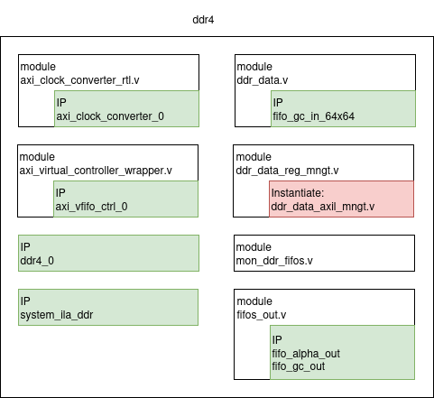

# DDR4
 Purpose of DDR4: when you get the click event on detection, you need to find the angle applied to that qubit (basis information). DDR4 is used to store the angle so that after get click event, base on value of global counter, you can find the angle. One other reason is that we have constraints over 100km distance between Alice and Bob, the delay on classical channel, so DDR4 is large enough to satisfy these constraints.
 Below is the overview pictures of modules and IPs in FPGA manage the data flow in DDR4:
 - IP DDR4: MIG IP supported by AMD. The core allow you interface directly with the physical Memory. To configure the MIG, follow instructions on opalkelly [DDR4 Memory](https://docs.opalkelly.com/xem8310/ddr4-memory/)
 - axi_virtual_controller_wrapper.v : use AXI Virtual FIFO Controller core from AMD to access DRAM memory as multiple FIFO blocks
 - axi_clock_converter_rlt.v use AXI Clock Converter core from AMD as interconnect, change clock domain, because AXI interface on MIG uses 300MHz clock domain
 - system_ila_ddr: monitoring AXI, AXIS interface and debug signals
 - ddr_data_reg_mngt.v: manages axil registers for commands, settings, status monitoring
 - ddr_data.v: manages data flow in/out axi_virtual_controller_wrapper, in/out xdma axistream fifos
 - mon_ddr_fifos.v: manages registers to monitor status of AXI Virtual FIFO Controller and axistream fifos
 - fifos_out.v: instantiate axistream output fifos. Instantiate in an RTL module allows Vivado changes FREQ_HZ parameter after rebuild block design from Tcl script 



## Axil registers

- dq : double qubit, 40MHz
- LSB : Least Significant Bit
- MSB : Most Significant Bit

Tables of Registers for parameters, base is 0x0000_1000

Address of slv_reg(n) = 0x0000_1000 + 4 * n


|axil registers	|Dir|Signal                 | Description
|---------------|---|-----------------------|--------------------------------------------------
|slv_reg0[0]	|O 	|start_write_ddr_o		|set this 0 to 1 to start write to ddr at next pps
|slv_reg1[0]	|O 	|command_enable_o		|set this 0 to 1 to get current dq
|slv_reg2[2:0]	|O 	|command_o				|set command to read_angle mode or reset alpha_out fifo
|slv_reg2[3]	|O 	|command_gc_o			|unused
|slv_reg3[0]	|O 	|reg_enable_o			|set this 0 to 1 to load others regs
|slv_reg4[31:0]	|O 	|dq_gc_start_lsb_o		|set the LSB of current dq
|slv_reg5[15:0]	|O 	|dq_gc_start_msb_o		|set the MSB of current dq
|slv_reg6[0]	|O 	|command_alpha_enable_o	|set this 0 to 1 to reset alpha_out fifo and start save alpha
|slv_reg6[1]	|O 	|pair_delay_o			|define if fiber delay [gc] % dq_gc = 0 or 1
|slv_reg7[0]	|O 	|command_gc_enable_o	|set this 0 to 1 to reset gc_out fifo and get data 
|slv_reg8[31:0]	|O 	|threshold_o			|number of clk200, define reading speed of gc_in fifo
|slv_reg9[31:0]	|O 	|threshold_full_o		|unused(used to debug size of ddr4)
|slv_reg10[31:0]|O 	|fiber_delay_o			|set fiber delay [gc] found in calibration
|slv_reg13[8:0] |I 	|ddr_fifos_status_i		|includes idle, empty and full flags of virtual fifo controller
|slv_reg14[2:0] |I 	|fifos_status_i			|includes full and empty flags of gc_out, alpha_out, gc_in fifos
|slv_reg15[31:0]|I 	|current_dq_gc_lsb_i	|monitors the LSB of current dq 
|slv_reg16[16:0]|I 	|current_dq_gc_msb_i	|monitors the MSB of current dq


## Data flow

#### START 
Alice sends START command to Bob through Ethernet. They both send the command to their FPGA, the START state will happen at next PPS and synchronise. Network latency has to be small enough, START command on Alice should not be close to the rising edge of PPS.

To make sure START command is not close to rising edge of PPS, Alice will request PPS detection from FPGA, she delays at least 10ms (PPS duty cycle) and send START command. Readback global counter on both Alice and Bob, compare to verify the synchronisation


#### WRITE MANAGEMENT
In START state, start to count up double global counter and write angles to DDR4. Angles are written as axistream data to AXI Virtual FIFO controller IP. This IP manages the memory map in the MIG, when you want to write or read from DDR4, you just need to manage write/read axistream of AXI Virtual FIFO controller

#### GC PATH
Bob FPGA gets detection result, sends gc (dq_gc and q_pos) and click result to Bob OS, only output when gc higher than fiber_delay. Bob then send gc to Alice (through Ethernet). They sends gc to their FPGA 

#### READ DDR4 MANAGEMENT
When FPGA of each party receives gc, start reading angles from DDR4 based on values of gc and fiber delays value. Make sure fifo_gc_in is not full and AXI Virtual FIFO Controller is not full, by defining fifo_gc_in reading speed higher than click rate, define depth of Virtual FIFO large enough 

#### SAVE ANGLES
Start saving the angles read from DDR4 to fifo_alpha_out. Choose a moment(value of gc) to start saving, consider the fiber delay between parties. 
Each party have to read angles before fifo_alpha_out is full.

This is the picture describes the states in FPGA, the path of data between Alice and Bob.


## Software control functions
- Ddr_Data_Reg : Set registers

```python,hidelines=~
def Ddr_Data_Reg(command,current_gc,read_speed, fiber_delay, pair_mode):
~    Write(0x00001000+8,hex(int(command)))
~    dq_gc_start = np.int64(current_gc) #+s
~    print(hex(dq_gc_start)) 
~    gc_lsb = dq_gc_start & 0xffffffff
~    gc_msb = (dq_gc_start & 0xffff00000000)>>32
~    threshold_full = 50000 #optinal for debug
~    Write(0x00001000+16,hex(gc_lsb))
~    Write(0x00001000+20,hex(gc_msb))
~    Write(0x00001000+32,hex(read_speed))
~    Write(0x00001000+36,hex(threshold_full))
~    Write(0x00001000+40,hex(fiber_delay))
~    Write(0x00001000+24,hex(pair_mode<<1))
~    #Enable register setting
~    Write(0x00001000+12,0x0)
~    Write(0x00001000+12,0x1)
```

- Ddr_Data_Init: reset ddr_data module
```python,hidelines=~
def Ddr_Data_Init():
~    #Reset module
~    Write(0x00001000, 0x00) #Start write ddr = 0
~    Write(0x00012000 + 16,0x00)
~    Write(0x00012000 + 16,0x01)
~    time.sleep(1)
~    print("Reset ddr data module")
```

- Ddr_Status: monitoring the fifos flags, monitoring every 0.1s
```python,hidelines=~
def Ddr_Status():
    while True:
~        ddr_fifos_status = Read(0x00001000 + 52)
~        fifos_status = Read(0x00001000 + 56)
~        hex_ddr_fifos_status = ddr_fifos_status.decode('utf-8').strip()
~        hex_fifos_status = fifos_status.decode('utf-8').strip()
~        vfifo_idle = (int(hex_ddr_fifos_status,16) & 0x180)>>7
~        vfifo_empty = (int(hex_ddr_fifos_status,16) & 0x60)>>5
~        vfifo_full = (int(hex_ddr_fifos_status,16) & 0x18)>>3
~        gc_out_full = (int(hex_ddr_fifos_status,16) & 0x4)>>2
~        gc_in_empty = (int(hex_ddr_fifos_status,16) & 0x2)>>1
~        alpha_out_full = int(hex_ddr_fifos_status,16) & 0x1
~        gc_out_empty = (int(hex_fifos_status,16) & 0x4)>>2
~        gc_in_full = (int(hex_fifos_status,16) & 0x2)>>1
~        alpha_out_empty = int(hex_fifos_status,16) & 0x1
~        current_time = datetime.datetime.now()
        ~print(f"Time: {current_time} VF: {vfifo_full} VE: {vfifo_empty}, VI: {vfifo_idle} | gc_out_f,e: {gc_out_full},{gc_out_empty} | gc_in_f,e: {gc_in_full},{gc_in_empty} | alpha_out_f,e: {alpha_out_full},{alpha_out_empty}", flush=True)
        ~#print("Time: {current_time}  VF: {vfifo_full}, VE: {vfifo_empty}, VI: {vfifo_idle} | gc_out_f,e: {gc_out_full}, {gc_out_empty} | gc_in_f,e: {gc_in_full}, {gc_in_empty} | alpha_out_f,e: {alpha_out_full}, {alpha_out_empty}                                                                      " ,end ='\r', flush=True)
        ~time.sleep(0.1)
```
Last test result
List of commands

|step| Alice|Bob|expect|
|----|------|---|------|
| 1  |      												| python -u server_ctl.py  		 | 
|    | python client_ctl.py init sp fg 						|                          		 | histogram is good
| 2  |                                  					| python -u server_ctl.py  		 | 
|    | python client_ctl.py fd_b        					|                          		 | 34 q_bins                
| 3  |                                  					| python main.py bob --pol_ctl   |
| 4  |                                  					| python -u server_ctl.py        |                          
|    | python client_ctl.py fd_a_mod    					|                                | 15 q_bins                
| 5  |                                  					| python -u server_ctl.py        |                          
|    | python client_ctl.py fd_a        					|                                | 4032 q_bins (10km fiber) 
| 6  | python main.py alice --ddr_data_reg 4 0 1999 0 0    	| python main.py bob --ddr_data_reg 4 0 1999 0 0     |                       
|    | python main.py alice --ddr_data_reg 3 0 1999 1992 0 	| python main.py bob --ddr_data_reg 3 4000 1999 17 1 |                       
|    | python main.py alice --ddr_data_init                	| python main.py bob --ddr_data_init                 |                       
|    |                                                     	| python server_ddr.py                               |                       
|    | python client_ddr.py                                	|                                                    |                        


In step 6, there are some parameters:
- 1999: define speed of read gc_in fifo. This is for click rate more than 50k and less than 100k
- the delay and pair parameters need to be verify
- In server and client, already tried to transmit global counter and write click result to the proper format to fifo -> need to verify with angle format

