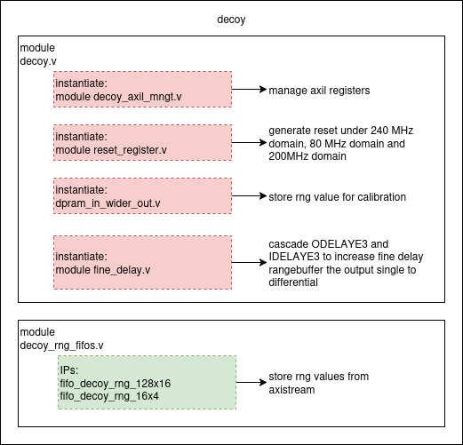

# Decoy signal
Purpose of this module:
- Generate signal for the second AM 
- Level is 0 or 1, apply randomly on qbit(12,5ns)
- Source of RNG is from second tRNG SwiftPro RNG



## Axil registers

|parameter                    |register name                | axil regs    | offset address |
|-----------------------------|-----------------------------|--------------|----------------
|reg_enable_o                 |reg_enable_o                 |slv_reg0[0]   |0 
|tune_step_o                  |tune_step_o                  |slv_reg1[3:0] |4
|trigger_enstep_o             |trigger_enstep_o             |slv_reg2[0]   |8
|trigger_enstep_slv1_o        |trigger_enstep_slv1_o        |slv_reg2[1]   |8
|trigger_enstep_slv2_o        |trigger_enstep_slv2_o        |slv_reg2[2]   |8
|decoy_rng_mode_o             |decoy_rng_mode_o             |slv_reg3[0]   |12
|decoy_params_80_o            |decoy_params_80_o            |slv_reg5[31:0]|20
|decoy_params_slv_o           |decoy_params_slv_o           |slv_reg6[31:0]|24
|decoy_dpram_max_addr_rng_int |decoy_dpram_max_addr_rng_int |slv_reg7[5:0] |28

## Generate signal

These are the functions to generate the signal
```python,hidelines=~
def decoy_reset():
~    Write(0x00012000 + 20,0x01)
~    time.sleep(2)
~    Write(0x00012000 + 20,0x00)
```
Test_Decoy() function writing data for fake rng dpram and choosing rng mode.
- Max address for dpram is 64
- Rng mode : 0 for fake, 1 for tRNG
- Start decoy_rng.service to if choosing tRNg mode

```python,hidelines=~
def Test_Decoy():
~    #dpram_rng_max_addr
~    Write(0x00016000 + 28, 0x10)
~    #Write data to rng_dpram
~    Base_seq0 = 0x00016000 + 1024
~    rngseq0 = 0x00000031
~    rngseq1 = 0x00000002
~    Write(Base_seq0, rngseq0)
~    Write(Base_seq0+4, rngseq1)
~    #Write rng mode
~    Write(0x00016000 + 12, 0x0)
~    #enable regs values
~    Write(0x00016000 , 0x0)
~    Write(0x00016000 , 0x1)
```
 

## Delays

Use these functions to add tune and fine delays for decoy signal. The principles is the same with TTL gate signal
- Tune step delay is 4.3ns, 8 steps
- Fine step delay is adjustable, maximum apro 1,4ns to 1,65ns for each master/slave 

```python,hidelines=~
def de_calculate_delay(fine, inc):
~    fine_clock_num = fine*16
~    transfer = fine_clock_num<<1|inc
~    transfer_bin = bin(transfer)
~    transfer_hex = hex(transfer)
~    return transfer_hex
```
```python,hidelines=~
def de_write_delay_master(tune, fine, inc):
~    #Write tune delay
~    Write(0x00016000 + 4, tune)
~    #Write fine delay master 
~    transfer = de_calculate_delay(fine, inc)
~    Write(0x00016000 + 20,transfer)
```
```python,hidelines=~
def de_write_delay_slaves(fine1, inc1, fine2, inc2):
~    Base_Add = 0x00016000 + 24
~    transfer = (fine2*16)<<17|inc2<<16|(fine1*16)<<1|inc1
~    Write(Base_Add, hex(transfer))
```
```python,hidelines=~
def de_params_en():
~    #enable regs values
~    Write(0x00016000 , 0x0)
~    Write(0x00016000 , 0x1)
```
```python,hidelines=~
def de_trigger_fine_master():
~    Base_Add = 0x00016000 + 8
~    Write(Base_Add, 0x0)
~    Write(Base_Add, 0x1)
~    time.sleep(0.02)
~    Write(Base_Add, 0x0)
~    print("Trigger master done")
```
```python,hidelines=~
def de_trigger_fine_slv1():
~    Base_Add = 0x00016000 + 8
~    Write(Base_Add, 0x0)
~    Write(Base_Add, 0x2)
~    time.sleep(0.02)
~    Write(Base_Add, 0x0)
~    print("Trigger slave1 done")
```
```python,hidelines=~
def de_trigger_fine_slv2():
~    Base_Add = 0x00016000 + 8
~    Write(Base_Add, 0x0)
~    Write(Base_Add, 0x4)
~    time.sleep(0.02)
~    Write(Base_Add, 0x0)
~    print("Trigger slave2 done")
```