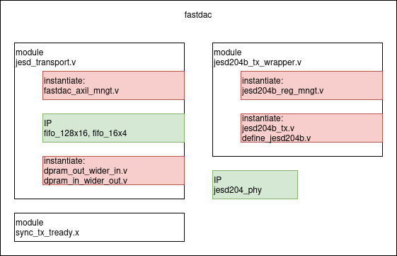

# Fast DAC

We use fast DAC chip AD9152 from Analog Device, converts digital to analog signal. So FPGA will be Transmitter and AD9152 is Receiver. This IC includes 2 DACs:
- DAC0 : output IOUT
- DAC1 : output QOUT


Kiwi device has qu-bit rate 80MHz, we use time-bin encoded, so DAC0 in Alice generates double pulse at 80MHz, DAC1 also generates signal for PM at the same rate. 
We calculated the JESD204B parameters before designing the sytem, you can find the parameters in registers we set for the chip. We set:
- lane rate 10Gbits/s per lane
- 4 lanes
- jesd in mode 4
- subclass 1
- refclk 200MHz
- sysref clk 3.125MHz 

Read [JESD204 Survival Guide](https://www.analog.com/media/en/technical-documentation/technical-articles/JESD204B-Survival-Guide.pdf) and [AD9152 datasheet](https://www.analog.com/media/en/technical-documentation/data-sheets/AD9152.pdf) to understand protocol. Read chapter JESD204B Setup in AD9152 datasheet to calculate lane rate.

## Receiver AD9152
- refclk and sysref comes from clock chip ltc9152
- registers setting in order by these functions in control software
```
Set_reg_powerup()
Set_reg_plls()
Set_reg_seq1() 
Set_reg_seq2()
```

## Transmitter FPGA
fastdac block is splited into 3 layers:
- jesd transport: module jesd_transport.v
- jesd: module jesd204b_tx_wrapper.v
- jesd phy: IP jesd204 phy



### Jesd transport
Generate data to provide for Jesd. There are 2 DACs inside AD9152, so DAC0 in charge of signal for AM, DAC1 in charge of signal for PM. 
- Maximum output power for each DAC is 600mV peak-to-peak into 50 Ohm load
- Sampling rate for each DAC: 800M sample/s, qubit rate = 80 MHz. So you have 10 samples for 1 double pulse period


#### Signal for AM   
- qbit is encoded in 5 ns double pulse, pulse rate is 80MHz (12,5ns). Pulse Generator(PG) triggers the rising edge of the DAC0 signal to generate the pulses, so make sure distance between 2 rising edge is 5ns +- 200ps. You can play around with Pulse Generator threshold and DAC0 signal to find the best position for PG trigger 
#### Signal for PM 
- Amplitude of DAC1 signal defines the phase difference applied to 2 bins from 0 to 2\\(\pi\\). Depends on power of the PM amplifier, you can reach higher amplitude. Two peaks of PM signal for 1 qubit is symetrique. 
- With BB84 protocol, the phase is random, there are 4 phase possibilities. Which means 1 double pulse requires 2 bits of rng, rng data rate = 80M* 2 = 160Mbits/s
- SwiftPro RNG USB output RNG data at roughly 200Mbits/s. So you have to read from fifo output 4bits at 40MHz -> 4bits rng selects the amplitude for DAC1 signal
- For the purpose of calibration, there is one option, rng can be put to dpram and read out 4bits at 40MHz. Knowing value of rng helps finding position of modulated qubit
- For visibility, apply sequence of 64 phases (from 0 to 2\\(\pi\\) or higher)
- Signal can be shifted 10 steps, 1,25ns each step

#### Programming note
- Axil registers 
From the Axil address distribution table, module target jesd_transport takes 64K from offset 0x0003_0000

|Offset        | max address |Range|Target
|--------------|-------------|-----|--------------------
|0x0003_0000   |0x0003_1000  |4096 | Regs for parameters
|0x0003_1000   |0X0003_2000  |4096 | Data for dpram_seqs
|0x0003_2000   |0X0004_0000  |57344| Data for dpram_rng

Tables of Registers for parameters, base is 0x0003_0000

Address of slv_reg(n) = 0x0003_0000 + 4 * n

|Slave_reg      | Reg name                        | Description
|---------------|---------------------------------|---------------
|slv_reg0[0]    |fastdac_en_jesd_o                |Unused
|slv_reg0[1]    |ld_ddr_status_o                  |Unused
|slv_reg1[3:0]  |fastdac_amp_dac1_shift_o         |shift 0..10
|slv_reg1[31:16]|fastdac_up_offset_o              |up offset in feedback mode
|slv_reg2[31:0] |fastdac_amp_dac1_o               |2 values of amp
|slv_reg3[0]    |dac1_shift_en_o                  |enable this reg to load others regs
|slv_reg4[7:0]  |fastdac_dpram_max_addr_seq_dac0_o|dpram_seq max ad
|slv_reg4[15:8] |fastdac_dpram_max_addr_seq_dac1_o|dpram_seq max ad
|slv_reg5[0]    |fastdac_rng_mode_o               |rng_mode
|slv_reg5[1]    |fastdac_dac1_mode_o              |dac1_mode
|slv_reg5[2]    |fastdac_fb_mode_o                |fb_mode
|slv_reg5[3]    |fastdac_zero_mode_o              |zero_mode
|slv_reg6[31:0] |fastdac_amp_dac2_o               |2 values of amp
|slv_reg7[14:0] |fastdac_dpram_max_addr_rng_dac1_o|dpram_rng max ad

dpram_seqs: address range is 4096, maximum you can write 1024 words to each dpram


dpram_rng: address range is 57344, maximum you can write 14336 words to dpram_rng. For calibration procedure over:
- 100km optical fiber (0.5ms), you need a sequence of 20000 dpram_rng [3:0], means 2500 axil words
- 10km optical fiber, you need 2000 dpram_rng[3:0], means 250 axil words


fifos_rng: SwiftRro RNG output data rate around 200Mb/s, we read fifo in fpga at 160Mb/s. 


There are several MUXs, simply choosing different modes for calibration purpose. When running the protocol, turn on all modes to 1


You have these 3 functions in software control to send data and write registers in jesd transport layer

```python,hidelines=~
def Write_Sequence_Dacs(rf_am):
~    #Write dpram_max_addr port out 
~    Base_Addr = 0x00030000
~    Write(Base_Addr + 16, 0x0000a0a0) #sequence64
~    #Write data to dpram_dac0 and dpram_dac1
~    Base_seq0 = Base_Addr + 0x1000  #Addr_axi_sequencer + addr_dpram
~    if (rf_am == 'off_am'):
~        seq_list = gen_seq.seq_dac0_off(64,0) #dac0_off(cycle_num, shift_pm) # am: off, pm: seq64
~    if (rf_am == 'off_pm'):
~        seq_list = gen_seq.seq_dac1_off(2, [-0.95,0.95], 64,0,0) # am: double pulse, pm: 0
~    elif (rf_am == 'sp'):
~        # seq_list = gen_seq.seq_dacs_sp_10(64,0,0) # am: single pulse, pm: seq64
~        seq_list = gen_seq.seq_dacs_sp(2, [-0.95,0.95], 64,0,0) # am: single pulse, pm: seq64
~    elif (rf_am == 'dp'):
~        # seq_list = gen_seq.seq_dacs_dp_10(64,0,0) # am: double pulse, pm: seq64
~        seq_list = gen_seq.seq_dacs_dp(2, [-0.95,0.95], 64,0,0,0) # am: double pulse, pm: seq64
~
~    vals = []
~    for ele in seq_list:
~        vals.append(int(ele,0))
~
~    fd = open("/dev/xdma0_user", 'r+b', buffering=0)
~    write_to_dev(fd, Base_seq0, 0, vals)
~    fd.close()
~    print("Set sequence for drpam_dac0 and dpram_dac1 finished")
```
```python,hidelines=~
def Write_Sequence_Rng():
~    Base_Addr = 0x00030000
~    Base_seq0 = 0x00030000 + 0x2000  #Addr_axil_sequencer +   addr_dpram
~    dpram_max_addr = 8
~    Write(Base_Addr + 28, hex(dpram_max_addr)) 
~    list_rng_zero = gen_seq.seq_rng_zero(dpram_max_addr)
~    
~    vals = []
~    for l in list_rng_zero:
~        vals.append(int(l, 0))
~    fd = open("/dev/xdma0_user", 'r+b', buffering=0)
~    write_to_dev(fd, Base_seq0, 0, vals)
~    fd.close()
~    print("Initialie fake rng sequence equal 0 ")
```
```python,hidelines=~
def Write_Dac1_Shift(rng_mode, amp0, amp1, amp2, amp3, shift):
~    Base_Addr = 0x00030000
~    amp_list = [amp0,amp1,amp2,amp3]
~    amp_out_list = []
~    for amp in amp_list:
~        if (amp >= 0):
~            amp_hex = round(32767*amp)
~        elif (amp < 0):
~            amp_hex = 32768+32768+round(32767*amp)
~        amp_out_list.append(amp_hex)
~    shift_hex = hex(shift)
~    up_offset = 0x4000
~    shift_hex_up_offset = (int(up_offset)<<16 | shift)
~    fastdac_amp1_hex = (amp_out_list[1]<<16 | amp_out_list[0])
~    fastdac_amp2_hex = (amp_out_list[3]<<16 | amp_out_list[2])
~    Write(Base_Addr + 8, fastdac_amp1_hex)
~    Write(Base_Addr + 24, fastdac_amp2_hex)
~    Write(Base_Addr + 4, shift_hex_up_offset)
~
~    #Write bit0 of slv_reg5 to choose RNG mode
~    #1: Real rng from usb | 0: rng read from dpram
~    #Write bit1 of slv_reg5 to choose dac1_sequence mode
~    #1: random amplitude mode | 0: fix sequence mode
~    #Write bit2 of slv_reg5 to choose feedback mode
~    #1: feedback on | 0: feedback off
~    #----------------------------------------------
~    #Write slv_reg5:
~    #0x0: Fix sequence for dac1, input to dpram
~    #0x02: Random amplitude, with fake rng
~    #0x03: Random amplitude, with true rng
~    #0x06: Random amplitude, with fake rng, feedback on
~    #0x07: Random amplitude, with true rng, feedback on
~    Write(Base_Addr + 20, hex(rng_mode))
~    #Trigger for switching domain
~    Write(Base_Addr + 12,0x1)
~    Write(Base_Addr + 12,0x0)
~
~#Read back the FGPA registers configured for JESD
~def ReadFPGA():
~    file = open("registers/fda/FastdacFPGAstats.txt","r")
~    for l in file.readlines():
~        addr, val = l.split(',')
~        ad_fpga_addr = str(hex((int(addr,base=16) + 0x10000)))
~        readout = Read(ad_fpga_addr)
~        #print(readout)
~    file.close()
```

### Jesd
Our developper replaces AMD JESD204 IP by jesd204b_tx_wrapper.v so you don't need to pay AMD for JESD204 IP.However, this module supports only jesd204b protocol in mode 4 and mode 10.
This function in software control sets all registers for jesd204b_tx_wrapper.v
```python,hidelines=~
def WriteFPGA():
~    file = open("registers/fda/FastdacFPGA_204b.txt","r")
~    for l in file.readlines():
~        addr, val = l.split(',')
~        ad_fpga_addr = str(hex((int(addr,base=16) + 0x10000)))
~        Write(ad_fpga_addr, val)
~        #print(ad_fpga_addr)
~        #print(val)
~    print("Set JESD configuration for FPGA finished")
~    file.close()
```

Read [Jesd204b overview](Jesd204_overview.pdf) written by our developper

### Jesd phy
Physical layer, where the stream of data from jesd is mapped to 4 physical GT lanes. This IP is provided by AMD. 

## Process to run scripts

```
python main.py party_name --sequence arg0
python main.py party_name --shift arg0 arg1 arg2 arg3 arg4 arg5
python main.py party_name --fda_init
```

--sequence includes:
- write samples for DACs to dpram0 and dpram1 from file, arg0: choose double pulse, single pulse or 0 to generate on DAC0, fix sequence 64 angles on DAC1
- write rng sequence to rng_dpram from file
- write the max_address value to read out from dpram0, dpram1, rng_dpram

--shift:
- arg0: mode 

Remind you setting mode in slave_reg5

|Slave_reg      | Reg name                        | Description
|---------------|---------------------------------|---------------
|slv_reg5[0]    |fastdac_rng_mode_o               |rng_mode
|slv_reg5[1]    |fastdac_dac1_mode_o              |dac1_mode
|slv_reg5[2]    |fastdac_fb_mode_o                |fb_mode
|slv_reg5[3]    |fastdac_zero_mode_o              |zero_mode

Depends on which calibration procedure, change the mode as your requirements

rng_mode|description                                                |usecase
--------|-----------------------------------------------------------|--------
0       |fix sequence for dac1 to dpram                             |phase is sequence of 64 angles in linear amplitude
2       |random amplitude, fake rng                                 |find shift delay 
6       |random amplitude, true rng data, feedback on               |find optical delay
15      |random amplitude, true rng data, feedback on, insert zero  |running qkd

- arg1 to arg4: amplitude of the phase signal [from -1 to 1]
- arg5: shift value from 0 to 10

--fda_init:
- Write configuration for jesd module
- Reset jesd module
- Set all registers for receiver ad9152
- Read back some registers of receiver for monitoring  
    0x084 & 0x281: dac pll and serdes pll locked status

    0x302: dyn_link_latency, should be 0. Otherwise, run again the fda_init
    
    0x470 to 0x473: all should be 0x0f, indicates all layers of jesd204b protocol is established

