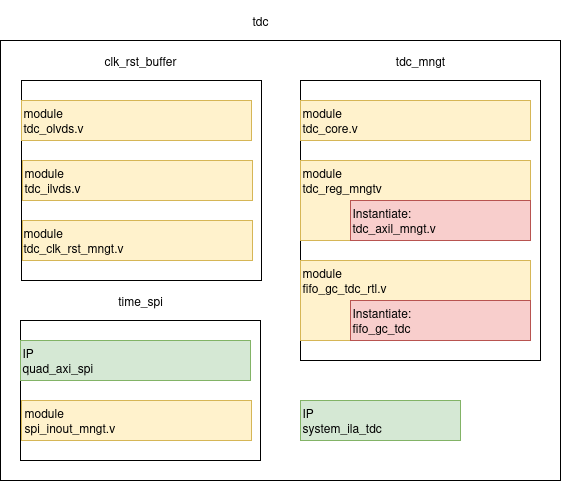
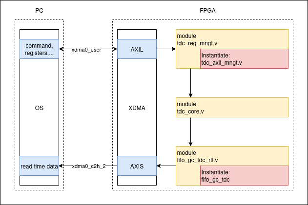

# TDC

We use AS6501 TDC(Time to Digital Converter) chip to convert arriving time of q-bit to digital data. All modules and IP manage in/out signals from TDC are grouped under block tdc:

	
## clk_rst_buffer
- OLVDS_TDC.v: buffer for differential output signals, clocks

|Signals name   |Interface      |Dir |Init status |Description
|---------------|---------------|----|------------|-----------
|tdc_lclki      |Clock          |I   |-           |source lclk for TDC chip
|tdc_refclk     |Clock          |I   |-           |source refclk for TDC chip
|tdc_rstidx     |Reset          |I   |-           |source rstidx for TDC chip
|tdc_lclki_n/p  |tdc_ext_clkrst |O   |-           |lclk differential pair output
|tdc_refclk_n/p |tdc_ext_clkrst |O   |-           |refclk differential pair output  
|tdc_rstidx_n/p |tdc_ext_clkrst |O   |-           |rsridx differential pair output  

- ILVDS_TDC.v: buffer for differential input signals,clocks

|Signals name   |Interface      |Dir |Init status |Description
|---------------|---------------|----|------------|-----------
|lclk_n/p       |tdc_ext_in     |I   |-           |lclk pair received from TDC chip
|frameA_n/p     |tdc_ext_in     |I   |-           |frameA pair received from TDC chip
|frameB_n/p     |tdc_ext_in     |I   |-           |frameB pair received from TDC chip 
|sdiA_n/p       |tdc_ext_in     |I   |-           |sdiA pair received from TDC chip 
|sdiB_n/p       |tdc_ext_in     |I   |-           |sdiB pair received from TDC chip   
|O_lclk         |-              |O   |-           |lclk in single-ended
|O_frameA       |-              |O   |-           |frameA in single-ended   
|O_frameB       |-              |O   |-           |frameB in single-ended   
|O_sdiA         |-              |O   |-           |sdiA in single-ended   
|O_sdiB         |-              |O   |-           |sdiB in single-ended   

- tdc_clk_rst_mngt.v : generate refclk 5MHz, rstindex for TDC; generate simulated STOPA signal for TDC

|Signals name         |Interface |Dir |Init status |Description
|---------------------|----------|----|------------|-----------
|clk200_i             |Clock     |I   |-           |clock source 200MHz
|tdc_rst              |Reset     |I   |-           |reset active HIGH
|pps_i                |-         |I   |-           |pps input from WRS
|stopa_sim_limit[31:0]|-         |I   |-           |registers to set division limit for stopa_sim <br> [7:0] divide_stopa : for fre <br> [15:8] limit_low : begin of duty cycle <br> [31:16] limit high: end of duty cycle 
|stopa_sim_enable_i   |-         |I   |-           |pull to high to update registers
|tdc_refclk_o         |-         |O   |-           |generated refclk for TDC
|tdc_rstidx_o         |-         |O   |-           |generated reset index for TDC
|pps_trigger          |-         |O   |-           |trigger PPS event
|stopa_sim            |-         |O   |-           |simulated STOPA of TDC

- User parameters of tdc_clk_rst_mngt

|User Parameter name |Value |Description
|---------------|------|-----------------
|N_COUNTER_APD  |800   |STOPA rate = 200M/(N_COUNTER_APD*divide_stopa)
|N_TDC_REFCLK   |8     |Every 8 periods of refclk, generate a rstidx
|TDC_DIV_HALF   |20    |refclk (MHz) = 200 (MHz) / (TDC_DIV_HALF*2)  
## time_spi
- Quad AXI spi: IP of AMD, manage to transfer data from AXI bus to spi bus. All information of IP is provided by Xilinx
- spi_inout_mngt.v: mananage inout pins from quad AXI spi to physical spi pins

|Signals name   |Interface      |Dir |Init status |Description
|---------------|---------------|----|------------|-----------
|mosi_io        |com_ext_spi    |IO  |-           |SPI MOSI
|miso_io        |com_ext_spi    |IO  |-           |SPI MISO
|ss_io[1:0]     |com_ext_spi    |O   |-           |SPI SS (2 bits for TDC and JITCLEAN)
|sck_io         |com_ext_spi    |O   |-           |SPI SCLK
|in0_i          |-              |I   |-           |connect io0_o of Quad AXI spi
|in0t_i         |-              |I   |-           |connect io0_t of Quad AXI spi
|out0_o         |-              |O   |-           |connect io0_i of Quad AXI spi
|in1_i          |-              |I   |-           |connect io1_o of Quad AXI spi
|in1t_i         |-              |I   |-           |connect io1_t of Quad AXI spi
|out1_o         |-              |O   |-           |connect io1_i of Quad AXI spi
|sck_i          |-              |I   |-           |connect sck_o of Quad AXI spi
|sckt_i         |-              |I   |-           |connect sck_t of Quad AXI spi
|sck_o          |-              |O   |-           |connect sck_i of Quad AXI spi
|ss_i[1:0]      |-              |I   |-           |connect ss_o of Quad AXI spi
|sst_i          |-              |I   |-           |connect ss_t of Quad AXI spi
|ss_o[1:0]      |-              |O   |-           |connect ss_i of Quad AXI spi
|rst_jic        |-              |O   |HIGH        |reset jitter cleaner

## system_ila_tdc 
ILA debug core, probes signals under tdc blocks
## tdc_mngt
- AS6501_IF.v: manages digital data from TDC, output tdc time/global counter/click result depends on axil commands

|Signals name         |Interface |Dir |Init status |Description
|---------------------|----------|----|------------|-----------
|m_axis sgnals        |m_axis    |IO  |-           |match with s_axis interface of fifo_gc_tdc_rtl.v 
|sr signals           |sr        |IO  |-           |match with mr interface
|lclk_i               |Clock     |I   |200MHz      |lclk
|clk200_i             |Clock     |I   |200MHz      |clk200
|m_axis_clk           |Clock     |I   |200MHz      |clock for m_axsi interface
|lrst_i               |Reset     |I   |Active HIGH |reset in domain lclk
|gc_rst               |Reset     |I   |Active HIGH |reset in domain clk200
|fifo_calib_rst       |Reset     |O   |Active LOW  |reset for the s_axis interface of fifo_gc
|linterrupt_i         |-         |I   |-           |interrupt signal from TDC
|frame_i              |-         |I   |-           |frame signal from TDC
|sdi_i                |-         |I   |-           |sdi signal from TDC
|pps_i                |-         |I   |-           |PPS signal from WRS
|rd_en_4              |-         |I   |-           |enable signal at 40MHz
|tvalid200            |-         |O   |-           |indicates gc is valid in clk200 domain
|tdata200             |-         |O   |-           |time data value in clk200 domain
|gc_time_valid[47:0]  |-         |O   |-           |gc value at the moment time data is valid
|q_gc_time_valid_mod16[3:0]|-    |O   |-           |gc value modulo 16 in 80MHz
|tdata200_mod[15:0]   |-         |O   |-           |tdata200%625
|gate_pos0[31:0]      |-         |O   |-           |pos0 of soft_gate0
|gate_pos1[31:0]      |-         |O   |-           |pos1 of soft_gate0
|gate_pos2[31:0]      |-         |O   |-           |pos0 of soft_gate1
|gate_pos3[31:0]      |-         |O   |-           |pos1 of soft_gate1
|others               |-         |O   |-           |other signals is for debug


- TDC_REG_MNGT_v1_0.v: manages axilite registers

User parameters:
```
parameter integer C_s_axil_DATA_WIDTH	= 32
parameter integer C_s_axil_ADDR_WIDTH	= 12
```

|Signals name         |Interface |Dir |Init status |Description
|---------------------|----------|----|------------|-----------
|standard axil signals|s_axil    |IO  |-           |s_axil interface for w/r registers 
|mr signals           |mr        |IO  |-           |registers of modules AS6501_IF.v (details in Axil registers)
|stopa_sim_limit[31:0]|-         |O   |-           |registers tdc_clk_rst_mngt.v (details in Axil registers)
|stopa_sim_enable_o   |-         |O   |-           |registers tdc_clk_rst_mngt.v (details in Axil registers)
|s_axil_aclk          |Clock     |I   |15MHz       |clock for axil interface  
|s_axil_aresetn       |Reset     |I   |avtive low  |reset for axil interface 


- fifo_gc_tdc_rtl.v: instantiates fifo_gc_tdc, this fifo is axistream fifo. Instantiate axistream fifo in an RTL module allows to modify FREQ_HZ parameter of axistream interface when rebuild the block design

|Signals name         |Interface |Dir |Init status |Description
|---------------------|----------|----|------------|-----------
|s_axis_tdata [127:0] |s_axis    |I   |-           |axis stream data gc in 
|s_axis_tuser [3:0]   |s_axis    |I   |-           |axis stream tuser
|s_axis_tvalid        |s_axis    |I   |-           |axis stream valid
|s_axis_tready        |s_axis    |O   |-           |aixs stream ready
|m_axis_tdata [127:0] |m_axis    |O   |-           |axis stream data gc out
|m_axis_tuser [3:0]   |m_axis    |O   |-           |axis stream tuser
|m_axis_tvalid        |m_axis    |O   |-           |axis stream valid
|m_axis_tready        |m_axis    |I   |-           |aixs stream ready
|m_aclk               |Clock     |I   |250MHz      |clock for m_axis interface
|s_aclk               |Clock     |I   |200MHz      |clock for s_axis interface
|s_aresetn            |Reset     |I   |-           |reset for s_axis interface, active low


### Axil registers
Offset address of slv_reg(n) = n*4, n is interger.

|signals in <br> TDC_REG_MNGT<br>_v1_0.v	|signals in <br> axil modules    |Dir|axil registers	| Description 
|-------------------------------|---------------------------|---|---------------|-------------
|mr_enable 		 			    |tdc_enable					|O	|slv_reg0[0]	|enable signal to receive sdi and frame from TDC
|mr_index_stop<br>_bitwise_i	    |tdc_index_stop<br>_bitwise_o	|O	|slv_reg1[15:0]	|define index and stop bitwise (matched with TDC setting) <br> index : slv_reg1[5:0] <br> stop: slv_reg1[13:8] 
|mr_start_gc_i				    |start_gc_o				    |O	|slv_reg2[0]	|pull high to enter START state
|stopa_sim_limit               	|stopa_sim_limit			|O	|slv_reg3[31:0]	|includes parameters to characterize stopa signal
|mr_gate0_i					    |gate0_o					|O	|slv_reg4[31:0]	|define soft gate0
|mr_gate1_i					    |gate1_o 					|O	|slv_reg5[31:0]	|define soft gate1
|mr_shift_tdc_time_i		    |shift_tdc_time_o			|O	|slv_reg6[15:0]	|define small shift for tdc time
|mr_shift_gc_back_i			    |shift_gc_back_o			|O	|slv_reg7[15:0]	|define small offset for gc
|mr_command_i				    |tdc_command_o				|O	|slv_reg8[2:0]	|define with mode (continuous or gated) to output gc
|mr_reg_enable_tdc_i		    |tdc_reg_enable_o			|O	|slv_reg9[0]	|update registers in lclk domain
|mr_reg_enable200_i			    |tdc_reg_enable200_o		|O	|slv_reg9[1]	|update registers in clk200 domain
|stopa_sim_enable             	|stopa_sim_enable_o			|O	|slv_reg9[2]	|enable register update for stopa_sim
|mr_command_enable			    |tdc_command_enable_o		|O	|slv_reg10[0]	|pull high to start filling gc to fifo
|mr_total_count_o			    |total_count_i				|I	|slv_reg16[31:0]|monitoring total click in gated APD
|mr_click0_count_o			    |click0_count_i				|I	|slv_reg15[31:0]|monitoring click in soft_gate0
|mr_click1_count_o			    |click1_count_i				|I	|slv_reg14[31:0]|monitoring click in soft_gate1
|mr_data_count_valid_o		    |data_count_valid_i			|I	|-              |signal to tell click count data is valid

### Data flow
Picture below shows an overview how data flows through modules and xdma channels. Responses to commands are written in modules AS6501_IF.v


### Software control functions
Setting registers used in state machine under clk200
```python,hidelines=~
def Time_Calib_Reg(command,t0, gc_back, gate0, width0, gate1, width1):
~    BaseAddr = 0x00000000
~    Write(BaseAddr + 16,hex(int(width0<<24 | gate0))) #gate0
~    Write(BaseAddr + 20,hex(int(width1<<24 | gate1))) #gate1
~    Write(BaseAddr + 24,hex(int(t0))) #shift tdc time = 0
~    Write(BaseAddr + 28,hex(int(gc_back))) #shift gc back = 0
~    Write(BaseAddr + 32,hex(int(command))) #command = 1: raw | =2: with gate
~    Write(BaseAddr + 36,0x0)
~    Write(BaseAddr + 36,0x2)# turn bit[1] to high to enable register setting
```
Initialize tdc module, global counter in tdc module is local, it means it's available in Bob only for calibration purpose. There are 2 state machines in tdc module:

- state machine under lclk_i: Config_Tdc() sets registers and enable this state machine, output digital data in FPGA 
- state machine under clk200: Reset_gc() and Start_gc() send command to reset and start global counter

```python,hidelines=~
def Time_Calib_Init():
~    Config_Tdc() #Get digital data from TDC chip
~    Reset_gc() #Reset global counter
~    Start_gc() #Global counter start counting at the next PPS
```
Get detection result, function Get_Stream() includes reset fifo_gc_tdc and read data from xdma0_c2h_*.
```python,hidelines=~
def Cont_Det(): 
~    num_data = 2000
~    Get_Stream(0x00000000+40,'/dev/xdma0_c2h_2','data/tdc/output_dp.bin',num_data)
~    command ="test_tdc/tdc_bin2txt data/tdc/output_dp.bin data/tdc/histogram_dp.txt"
~    s = subprocess.check_call(command, shell = True)
~
~    time_gc = np.loadtxt("data/tdc/histogram_dp.txt",usecols=(1,2),unpack=True)
~    int_time_gc = time_gc.astype(np.int64)
~    duration = (max(int_time_gc[1])-min(int_time_gc[1]))*25
~    click_rate = np.around(num_data/(duration*0.000000001),decimals=4)
~    print("Number of count: ", str(len(int_time_gc[1])))
~    print("Appro click rate: ", str(click_rate), "click/s")

```