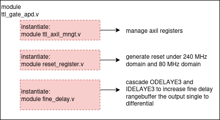

# TTL gate
Purpose of this module:
- Generate gate signal for APD, level TTL 3.3V out of FPGA (level is converted on Bread70 for APD)
- Duty cycle > 5ns
- Delay full range 12.5ns, fine delay in 100ps step



## Axil registers
|parameter      |register name                  | offset address (dec) |
|---------------|-------------------------------|---------|
|en_step   		|ttl_trigger_enstep_o[0]		|0
|en_step_slv1   |ttl_trigger_enstep_slv1_o[0]	|16
|en_step_slv2   |ttl_trigger_enstep_slv2_o[0]	|20
|duty_val		|ttl_params_o[22:19]			|4
|delay_val		|ttl_params_o[18:15]			|4
|resolution		|ttl_params_o[14:1] 			|4
|increase_en	|ttl_params_o[0]				|4
|resolution_slv2|ttl_params_slv_o[30:17] 		|12
|increase_en_slv2|ttl_params_slv_o[16]			|12
|resolution_slv1|ttl_params_slv_o[14:1] 		|12
|increase_en_slv1|ttl_params_slv_o[0]			|12
|ttl_params_en_o|ttl_params_en_o[0]				|8

## Generate signal
- Clock domain: 240 MHz
- Trigger PPS and align the pulse to PPS
- Change duty and tune delay the pulse with duty_val and delay_val
- Output will be fed into fine delay

These are the base functions allow to set registers, generate signal, change duty cycle and tune delay  
```python,hidelines=~
def ttl_reset():
~    Write(0x0001200c,0x01)
~    Write(0x0001200c,0x00)
~    time.sleep(2)
```
```python,hidelines=~
def calculate_delay(duty, tune, fine, inc):
~    fine_clock_num = fine*16
~    transfer = duty<<19|tune<<15|fine_clock_num<<1|inc
~    transfer_bin = bin(transfer)
~    transfer_hex = hex(transfer)
~    return transfer_hex
```
```python,hidelines=~
def write_delay_master(duty, tune, fine, inc):
~    Base_Add = 0x00015004 
~    transfer = calculate_delay(duty, tune, fine, inc)
~    Write(Base_Add,transfer)
```
```python,hidelines=~
def write_delay_slaves(fine1, inc1, fine2, inc2):
~    Base_Add = 0x0001500c
~    transfer = (fine2*16)<<17|inc2<<16|(fine1*16)<<1|inc1
~    Write(Base_Add, hex(transfer))
```
```python,hidelines=~
def params_en():
~    Base_Add = 0x0015008
~    Write(Base_Add,0x00)
~    Write(Base_Add,0x01)
```

## Fine delay
AMD support ODELAYE3 primitives to delay a signal in ps step, full range is 1,25ns. Read [UG974](https://docs.amd.com/v/u/2017.1-English/ug974-vivado-ultrascale-libraries) and [UG571](https://docs.amd.com/r/en-US/ug571-ultrascale-selectio/VAR_LOAD-Mode?tocId=6Pvw1KYIWoLfYxO5WATjSQ) for more details

Tune delay step is around 4,16ns. So, I choose Cascade configuration for ODELAYE3
- DELAY_FORMAT = COUNT
- DELAY_TYPE = VARIABLE
- UPDATE_MODE = ASYNC

Trigger the fine delay on master and 2 slaves, every trigger will shift your signal fine [taps] set in write_delay_* function
```python,hidelines=~
def trigger_fine_master():
~    Base_Add = 0x00015000
~    Write(Base_Add, 0x0)
~    Write(Base_Add, 0x1)
~    time.sleep(0.02)
~    Write(Base_Add, 0x0)
~    print("Trigger master done")
```
```python,hidelines=~
def trigger_fine_slv1():
~    Base_Add = 0x00015000
~    Write(Base_Add + 16, 0x0)
~    Write(Base_Add + 16, 0x1)
~    time.sleep(0.02)
~    Write(Base_Add + 16, 0x0)
~    print("Trigger slave1 done")
```
```python,hidelines=~
def trigger_fine_slv2():
~    Base_Add = 0x00015000
~    Write(Base_Add + 20, 0x0)
~    Write(Base_Add + 20, 0x1)
~    time.sleep(0.02)
~    Write(Base_Add + 20, 0x0)
~    print("Trigger slave2 done")
```