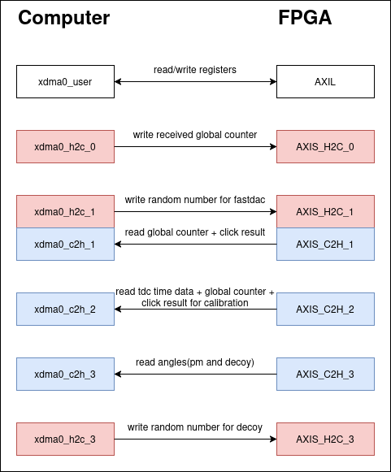

# XDMA

XDMA block use "DMA for PCI Express (PCIe) Subsystem" IP supported by AMD. You can click the IP in block design to see the configuration parameters. For Kiwi device:
- Use 4 lanes at full speed 8GT/s
- Axilite 32 bits
- Axilite master space 32MB
- Axistream 128 bits, clock 250MHz
- Use full 4 axistream channels (H2C/C2H)

The picture below shows the actual number of channel and purpose of each channel

 

From Axil of XDMA, connect with AXI Interconnect IP to divide address space for sub-modules. Changing the size of address space depends on the number of registers need to be written through Axil to Axil of sub-modules. You can check the Axil address distribution in block design or in the table below:

|Offset      | Range         | Target RTL module/ IP|
|------------|---------------|----------------------|
|0x0000_0000 |0x0000_1000 4K | tdc/tdc_mngt/TDC_REG_MNGT_v1_0.v|
|0x0000_1000 |0x0000_1000 4K | ddr4/ddr_data_reg_mngt.v|
|0x0001_0000 |0x0000_1000 4K | fastdac/jesd204b_tx_wrapper.v|
|0x0001_2000 |0x0000_1000 4K | clk_rst/clk_rst_mngt.v|
|0x0001_3000 |0x0000_1000 4K | tdc/time_spi/axi_quad_spi|
|0x0001_5000 |0x0000_1000 4K | ttl_gate_apd.v|
|0x0001_6000 |0x0000_1000 4K | decoy.v|
|0x0002_0000 |0x0001_0000 8K | spi_dacs_ltc/axi_quad_spi|
|0x0003_0000 |0x0008_0000 64K| fastdac/jesd_transport.v|
