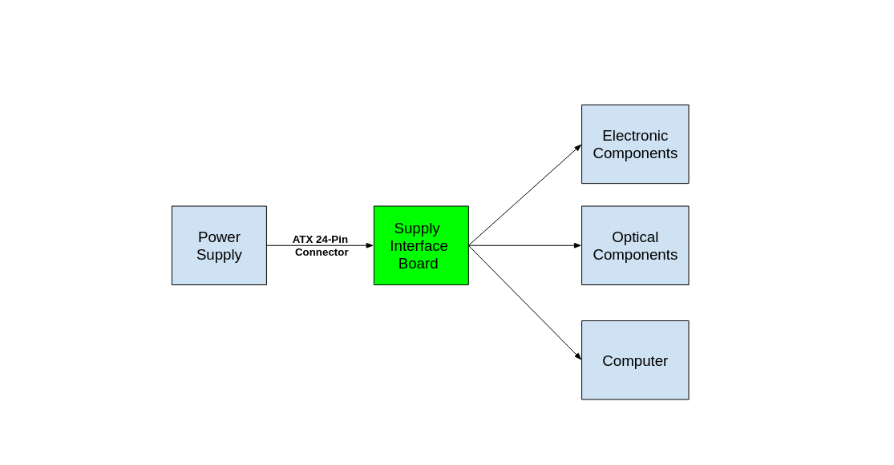
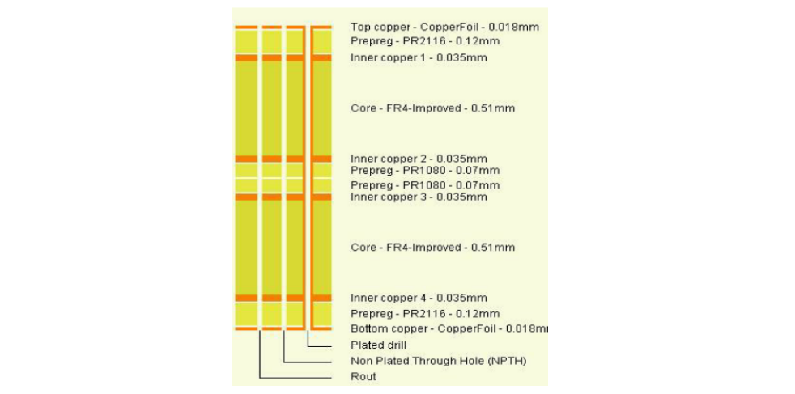
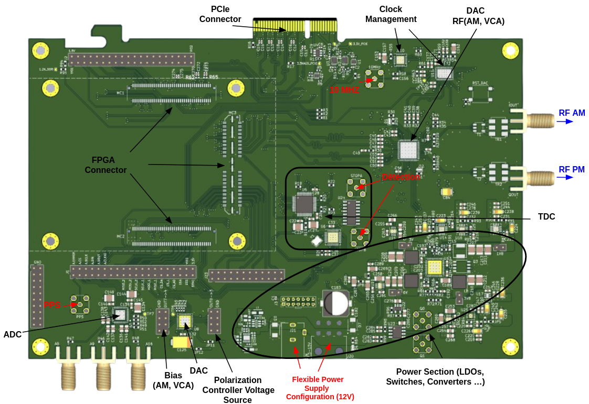
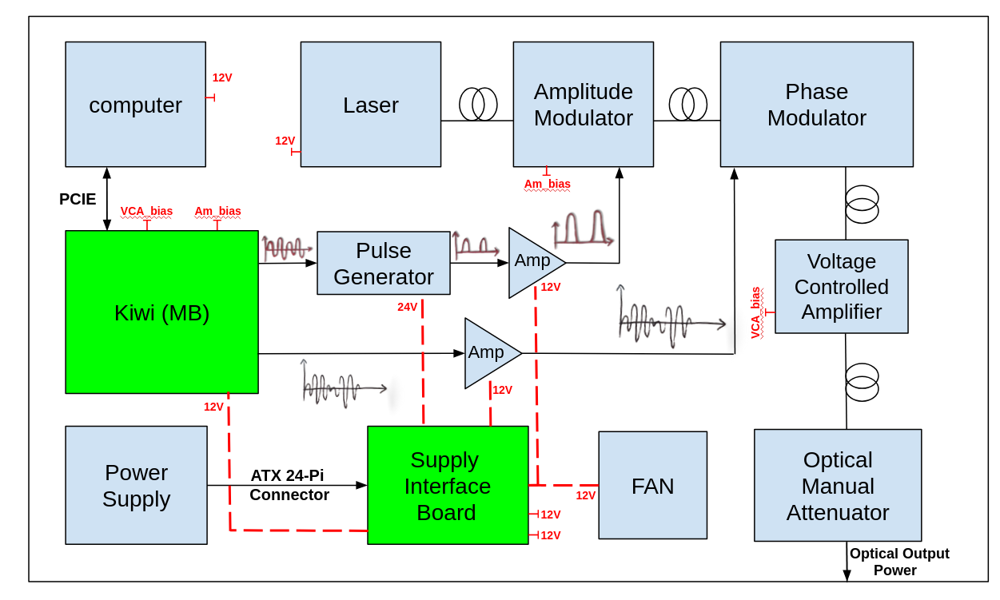

# Design PCB

In this section, we will describe the PCB design for the power interface and Kiwi MB, as well as the specific functionalities implemented on these boards, their role, and their integration into the overall system.

## I. Supply Interface Board

The Supply Interface Board acts as an interface between the main power supply and the electronic, optical, and computer components, as shown in the figure below.

### Spécifications:

**Outputs:**
- 6 × 12 V (total 24 A),
- 1 × 5 V/1 A,
- 1 × ±12 V (total 1.2 A/0.1 A),
- 1 × 24 V/0.6 A.

**Main Power Supply:**
- Powered by a PC ATX power supply connected via a 24-pin ATX connector.

---

## II. Kiwi_MB

The Kiwi Motherboard (Kiwi_MB) is designed for the management and processing of analog and digital signals. It features a slot for the XEM8310 FPGA from OpalKelly, a PCIe connector for interfacing with the computer, as well as a section dedicated to clock and power management. The board also includes DACs and ADCs with SMA inputs and outputs for signal processing.

### Materials and Stack-up

| **Category**         | **Détails**                          |
|-----------------------|--------------------------------------|
| Dimensions            | Width: 200.0 mm, Height: 138.4 mm   |
| Number of layers      | 6 (see the figure below)            |
| Board thickness       | 1.55 mm                             |
| Base material         | IS400 (Tg: 145-150°C)               |
| Copper                | Outer layer: 18μm, Inner layer: 35μm|
| Minimum hole size     | 0.45 mm                             |
| Trace design          | All traces are designed to ensure optimal adaptation to signal frequencies and power, maintaining a characteristic impedance of 50 ohms. |
---

### Functionalities Implemented on Kiwi_MB PCB:

#### Power Management:
The Kiwi Motherboard (Kiwi MB) is powered by a 12 V supply, which is then converted into multiple voltages through the following Power Management system:
- **Five Buck Converters:** Producing 1.8 V, 3.8 V, 3 V, 6 V, and 10.5 V.
- **One Buck-Boost Converter:** Generating an inverted -10.5 V.
- The system includes twelve jumpers: four standard connectors and eight 0 Ω resistors, which must be installed one at a time, verifying the voltages at each step.
- Finally, 8 Linear Regulators (LDO) provide additional voltages: 3.3 V (x2), 2.5 V, 3.8 V, 5 V, and 1.2 V (x3), ensuring stable power for the components.

#### Clock Management:
The clock management architecture aims to manage synchronization signals in order to improve the system's precision. A 10 MHz reference signal from the White Rabbit Switch (WRS) is sent to the CDCLVD2104, a clock signal buffer, which then passes it to the LTC6951 to generate the necessary clocks for the AD9152 fast DACs, as well as for the TDC and TTL Gate via the FPGA. The CDCLVD2104 also generates the 10 MHz SPI synchronization signal. Additionally, the PPS (Pulse Per Second) signal from the WRS is used as a reference signal for clock alignment, ensuring precise synchronization of the system's components.

#### DACs and ADCs:
Kiwi_MB contains two DACs and one ADC for signal conversion and generation:
- **DAC81408RHAT:** This DAC is used to generate polarization voltage signals (AM and VCA) on channels 6 and 7, as well as for the polarization controller on channels 0 to 3.
- **AD9152 Fast DAC:** A high-speed DAC used to generate the RF signals RF_AM and RF_PM, necessary for producing analog RF outputs sent to the amplitude and phase modulators.
- **AD7175-8 ADC:** An analog-to-digital converter with three inputs for converting analog RF signals into digital format for further processing.
- These components are managed by the FPGA to ensure efficient signal conversion and the generation of the necessary voltages for the different channels.

#### TDC:
The TDC system uses four components to convert the arrival times of qubits into digital data. The single-photon detector generates raw data, which is retrieved via an SMA connector and sent to the DS90C031B, an LVDS driver, and then transmitted to the AS6501. The AS6501, a Time-to-Digital Converter (TDC), measures the arrival times and converts them into digital data. The reference signal, generated by the ECX-32 crystal and the Si55319, synchronizes the entire system by producing a differential signal sent to the AS6501, ensuring precise time measurements.

---

### Integration of the Kiwi_MB and Supply Interface Board in the Kiwi Box

Below is a diagram illustrating an example of the integration of the Kiwi_MB and the power interface board, as well as their interaction with the electronic and optical components in Alice's box.

