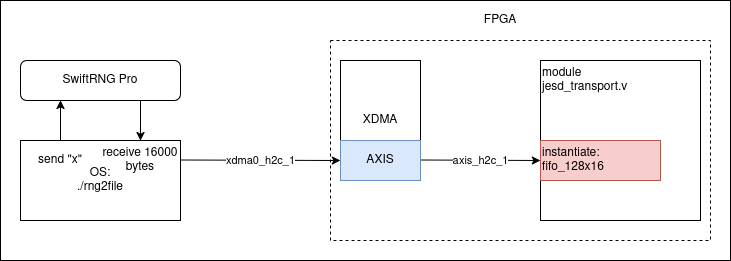

# WRS, Computer, tRNG
## WRS

## Customized computer
Customized computer from [Sedatech](https://www.sedatech.net/)
- Processor:  Intel i7-14700T
- RAM: 16Gb DDR5-5200
- Graphic card: Intel UHD Graphics 770
- Mother board: Asrock Z790M-ITX/Wifi
- SSD: 500Go NVMe
- Aircooling: Jonsbo HX4170D
- Power supply: 150W External power supply

Instruction to deploy the computer is available on GitHub [kiwi_hw_control](https://github.com/Veriqloud/kiwi_hw_control.git)

## tRNG
To generate random number for QKD, we use SwiftRNG Pro from TectroLabs. [Documentation](https://tectrolabs.com/swiftrng-pro/) for device is available on website of TectroLabs.

Picture below show you the path of random bytes. We have a small API sends "x" command to SwiftRNG Pro, the device returns 16000 bytes of random data. Then data is sent through PCIe to FPGA using axistream protocol, jesd_transport.v manages to read data from axistream fifo fifo_128x16

