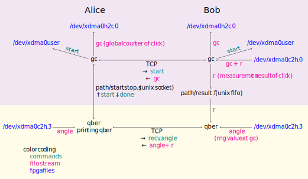

# Files and Scripts

## Files for communication between OS and FPGA or between processes

| name                            | meaning                                                               | type                                                             | used by                                     |
| ----                            | ----                                                                  | ----                                                             | ----                                        |
| /dev/xdma0_user                 | FPGA registers for control and monitoring                             | memory map; addresse with respect to bytes, values 4bytes=32bit  | `hw_alice.py` / `hw_bob.py`, `hws.py` `gc`  |
| /dev/xdma0_c2h_0                | global counter (qubit identifier) and click result of detected qubit  | FPGA to OS fifo 128bit/word                                      | `gc`                                        |
| /dev/xdma0_h2c_0                | global counter of detected qubit                                      | OS to FPGA fifo 128bit/word                                      | `gc`                                        |
| /dev/xdma0_h2c_1                | RNG values                                                            | OS to FPGA fifo 128bit/word                                      |                                             |
| /dev/xdma0_c2h_2                | TDC timestamps, global counter, click result for calibration          | FPGA to OS fifo 128bit/word                                      | `hws.py`,  `hw_bob.py`                      |
| /dev/xdma0_c2h_3                | angles (rng values of detected qubits)                                | FPGA to OS fifo 128bit/word                                      | `node`, `qber`                              |
| ~/qline/hw-control/startstop.s  | start and stop the raw key generation                                 | unix stream; each byte a command                                 | `node`, `qber`                              |
| ~/qline/hw-control/result.f     | measurement result (on Bob only)                                      | unix fifo; each byte a result                                    | `node`, `qber                               |

The dataflow when you run `qber`

## Programs and control scripts

| name                        | meaning                                                                                                                                      |
| ----                        | ----                                                                                                                                         |
| `hw_alice.py`; `hw_bob.py`  | manually change hardware settings individually on Alice and Bob (see help message of the sript)                                              |
| `hws.py`                    | hardware init procedures controlled by Alice                                                                                                 |
| `gc`                        | background process to send gc from Bob to Alice and start/stop raw key generation; gc_client is waiting for start/stop from another program  |
| `qber`                      | calculate qber (for calibration only)                                                                                                        |
| `node`                      | send start/stop to gc_client; process raw key to final key (qber estimation, error correction, privacy amplification)                        |
| `kms`                       | key management service; takes key from `node`                                                                                                |

## Config files

| name                 | meaning                     |  edited by        |
| ----                 | ----                        | ----            |
| ~/hw_control/config/defaults.txt  | initial hardware parameters  | Admin   |
| ~/hw_control/config/tmp.txt  | running hardware parameters  | `hw_bob.py` / `hw_alice.py`, `hws.py`,   |
| ~/config/  | high level configuration for all programs  | Admin (through gen_config)  |

Meaning of paramters in config/defaults.txt and config/tmp.txt:

| name             | value          | meaning                                                                          | only on  |
| ---------        | ------         | -----------                                                                      | ------   |
| angleX           | [-1,1]         | the four angle values to be applied onto the phase modulator                     |          |
| am_mode          | off            | amplitude modulator is not sending pulses                                        | Alice    |
|                  | single         | single pulse every two repetitions (at 40MHz)                                    | Alice    |
|                  | double         | double pulse every repetition (qubits at 80 MHz)                                 | Alice    |
|                  | single64       | single pulse every 64 repetitions                                                | Alice    |
| am_shift         | [0,640)        | fine shift the amplitude modulator in units of 1/10 qubit distance               | Alice    |
| pm_mode          | off            | `0` angle everywhere                                                             |          |
|                  | seq64          | 64 periodic sequence of alternating, linearly increasing angle values            |          |
|                  | fake_rng       | periodic, predefined rng sequence                                                |          |
|                  | true_rng       | true rng                                                                         |          |
| pm_shift         | [0,640)        | Same as am. In case of `pm_mode == *_rng` the value is taken mudulo 10           |          |
| fiber_delay_mod  | [0,32)         | delay angles before postprocessing in units of double repetition rate modulo 32  |          |
| fiber_delay      | [0,..]         | same but full range                                                              |          |
| insert_zeros     | {on,off}       | insert zeros every 16 repetitions                                                |          |
| zero_pos         | [0,16)         | at this position                                                                 |          |
| feedback         | {on,off}       | compensate interferometer drift based on click result at the zeros position      | Bob      |
| am_bias          | [-10,10]       | bias in volt for background suppression                                          | Alice    |
| vca              | [0,5]          | bias in volt for attenuation to single photon level                              | Alice    |
| qdisatnce        | [-1,1]         | fine tune the distance of the double pulse around 5ns                            | Alice    |
| SPD_mode         | {gated, free}  | gated or continuous mode                                                         | Bob      |
| SPD_deadtime     | [8,100]        | deadtime in microseconds                                                         | Bob      |
| SPD_eff          | {20,30}        | detection efficiency                                                             | Bob      |
| gate_delay       | [0,12000]      | delay TTL gate pulse to SPD in ps                                                | Bob      |
| gate_delayX      | [0,404)        | internal values for gate_delay                                                   | Bob      |
| t0               | [0,100]        | detection time offset in units of 20ps (to fine align the gates)                 | Bob      |
| polX             | [0,5]          | voltage to the 4 axis polarization controller                                    | Bob      |

