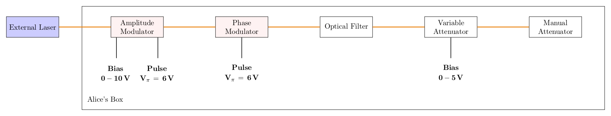
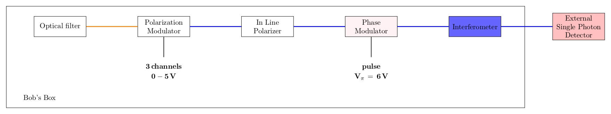
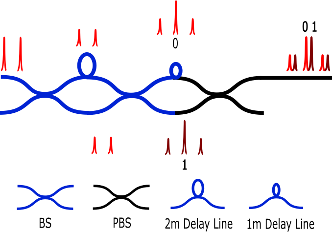

# Optics

## Alice

We use an external Laser: [Thorlabs SFL1550P](https://www.thorlabs.com/thorproduct.cfm?partnumber=SFL1550P). Butterfly package, fully controlled by [Laser Driver](https://www.koheron.com/photonics/ctl300e-industrial-laser-controller).
We have the following components on Alice's box:
- Amplitude Modulator  [iXblue MXER-LN-10-PD-P-P-FA-FA-30dB](https://www.ixblue.com/photonics-space/intensity-modulators/)
- Phase Modulator  [iXblue MPZ-LN-10-P-P-FA-FA](https://www.ixblue.com/photonics-space/phase-modulators/)
- Filter from AMS [OZ Optics](https://shop.amstechnologies.com/FF-Fixed-Filters/SW10901) custom band pass; 
    - passband: 1510nm - 1585nm
    - transmission: 0.72dB @ 1550nm
    - rejection: 61dB @ 850nm, 30dB specified elsewere
- Variable Attenuator: Voltage-controlled Attenuator on Dark Mode [fs.com](https://www.fs.com/fr/products/35199.html)
- Manual Attenuator: Manual Attenuator [Thorlabs VOA50](https://www.thorlabs.com/thorproduct.cfm?partnumber=VOA50PM-APC)

## Bob 

We have the following components on Bob's box:
- Filter from AMS [OZ Optics](https://shop.amstechnologies.com/FF-Fixed-Filters/SW10901) custom band pass; 
    - passband: 1510nm - 1585nm
    - transmission: 0.72dB @ 1550nm
    - rejection: 61dB @ 850nm, 30dB specified elsewere
- Polarization modulator from  AMS [LUNA (General Photonics)](https://shop.amstechnologies.com/PCD-M02-Polarization-Controller/SW11286). 
After Polarization Modulator all fibers are polarization maintaining ones [P3-1550PMY-1](https://www.thorlabs.com/thorproduct.cfm?partnumber=P3-1550PM-FC-1).
- In Line Fiber Polarizer from [Thorlabs](https://www.thorlabs.com/thorproduct.cfm?partnumber=ILP1550PM-APC)
- Phase Modulator  [iXblue MPZ-LN-10-P-P-FA-FA](https://www.ixblue.com/photonics-space/phase-modulators/)
- Interferometer. Fully passive  with two [Polarization maintaining beam splitters PN1550R5A2 (BS)](https://www.thorlabs.com/thorproduct.cfm?partnumber=PN1550R5A2) + one [Polarized Beam Splitter (PBS)](https://www.thorlabs.de/thorproduct.cfm?partnumber=PBC1550SM-APC) + 2m Polarization maintaining fiber [PMP-15-R-L-2-2SA-2SA](https://www.afwoptics.com.au/index.php?route=product/product&product_id=881) + 1m Polarization maintaining fiber [PMP-15-R-L-1-2SA-2FA](https://www.afwoptics.com.au/index.php?route=product/category&path=65). All ends for all BS and PBS used for the interferometer are with the narrow key of each connector aligned to the slow axis of the fiber. Only 2m Polarization maintaining fiber has the narrow key of one connector aligned to the fast axis of the fiber (the one connected to the input of PBS)

For detection, we use an external Avalanche Photo Diode [OEM module by Aurea (standard grade)](https://www.aureatechnology.com/en/products/oem-photon-counter.html) with [datasheet](https://www.aureatechnology.com/images/produits/AUREA_Datasheet_OEM_NIR_2020_A4.pdf).
## Laser

The system runs well with a non-tunable CW laser with 100kHz bandwidth and center wavelength at around 1550nm. 

The center wavelength depends on the components chosen: the beam splitters in the interferometer, optical filter, modulators. We tested the system between 1530nm and 1570nm. The qber went up slightly from 4% at 1550nm to 6% at 1530nm and 1565nm. 

The bandwidth must be small enough to interfere with high visility on the unbalanced Mach-Zehnder interferometer. We can roughly estimate the qber contribution as $1 - \exp(-\tau/\tau_c)$, where $\tau_c$ is the coherence time and $\tau$ the delay of the Mach-Zehnder.

The stability of the laser must be good enough to allow phase stabilization of the Mach-Zehnder interferometer (which is done based on SPD counts, which is slow). As a rule of thumb, a pi phasedrift of the Mach-Zehnder interferometer should be of the order of 1s or slower. This is fine for thermal drifts. However, if the laser is tunable, it will often actively tune the center wavelength. We tested two tunable lasers. Only one of them worked in it's ultra-narrow linewidth mode: The RIO COLORADO Widely Tunable 1550nm Narrow Linewidth Laser Source.

## Detector 

The detector is a crutial component of the system. It limits the key rate on the low-loss side becaus there is a maximum count rate. It limits the maximum distance because it has dark counts. For InGaAs SPDs, the afterpulses increase the qber. 

We use the Aurea OEM module in gated mode. Additionally we apply software filters around the peaks to reduce background as much as possible. We set the dead time to around 20us. Interestingly, we noticed that changing the detection efficiency setting between 10% and 20% yield similar key rates. Even though the count rates are higher at a higher detection efficiency, the qber also goes up and/or the dead time needs to be increased. 

