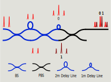

# Optics

## Alice

We use an external Laser: [Thorlabs SFL1550P](https://www.thorlabs.com/thorproduct.cfm?partnumber=SFL1550P). Butterfly package, fully controlled by [Laser Driver](https://www.koheron.com/photonics/ctl300e-industrial-laser-controller).
We have the following components on Alice's box:
- Amplitude Modulator  [iXblue MXER-LN-10-PD-P-P-FA-FA-30dB](https://www.ixblue.com/photonics-space/intensity-modulators/)
- Phase Modulator  [iXblue MPZ-LN-10-P-P-FA-FA](https://www.ixblue.com/photonics-space/phase-modulators/)
- Filter from AMS [OZ Optics](https://shop.amstechnologies.com/FF-Fixed-Filters/SW10901) custom band pass; 
    - passband: 1510nm - 1585nm
    - transmission: 0.72dB @ 1550nm
    - rejection: 61dB @ 850nm, 30dB specified elsewere
- Variable Attenuator: Voltage-controlled Attenuator on Dark Mode [fs.com](https://www.fs.com/fr/products/35199.html)
- Manual Attenuator: Manual Attenuator [Thorlabs VOA50](https://www.thorlabs.com/thorproduct.cfm?partnumber=VOA50PM-APC)

## Bob 

We have the following components on Bob's box:
- Filter from AMS [OZ Optics](https://shop.amstechnologies.com/FF-Fixed-Filters/SW10901) custom band pass; 
    - passband: 1510nm - 1585nm
    - transmission: 0.72dB @ 1550nm
    - rejection: 61dB @ 850nm, 30dB specified elsewere
- Polarization modulator from  AMS [LUNA (General Photonics)](https://shop.amstechnologies.com/PCD-M02-Polarization-Controller/SW11286). 
After Polarization Modulator all fibers are polarization maintaining ones [P3-1550PMY-1](https://www.thorlabs.com/thorproduct.cfm?partnumber=P3-1550PM-FC-1).
- In Line Fiber Polarizer from [Thorlabs](https://www.thorlabs.com/thorproduct.cfm?partnumber=ILP1550PM-APC)
- Phase Modulator  [iXblue MPZ-LN-10-P-P-FA-FA](https://www.ixblue.com/photonics-space/phase-modulators/)
- Interferometer. Fully passive  with two [Polarization maintaining beam splitters PN1550R5A2 (BS)](https://www.thorlabs.com/thorproduct.cfm?partnumber=PN1550R5A2) + one [Polarized Beam Splitter (PBS)](https://www.thorlabs.de/thorproduct.cfm?partnumber=PBC1550SM-APC) + 2m Polarization maintaining fiber [PMP-15-R-L-2-2SA-2SA](https://www.afwoptics.com.au/index.php?route=product/product&product_id=881) + 1m Polarization maintaining fiber [PMP-15-R-L-1-2SA-2FA](https://www.afwoptics.com.au/index.php?route=product/category&path=65). All ends for all BS and PBS used for the interferometer are with the narrow key of each connector aligned to the slow axis of the fiber. Only 2m Polarization maintaining fiber has the narrow key of one connector aligned to the fast axis of the fiber (the one connected to the input of PBS)

For detection, we use an external Avalanche Photo Diode [OEM module by Aurea (standard grade)](https://www.aureatechnology.com/en/products/oem-photon-counter.html) with [datasheet](https://www.aureatechnology.com/images/produits/AUREA_Datasheet_OEM_NIR_2020_A4.pdf).

### Drivers and amplifiers
- Laser driver: [Koheron CTL300E](https://www.koheron.com/photonics/ctl300e-industrial-laser-controller)
	- Communication over serial from FPGA.
	- 6V-33V power.

- Amplifier for Amplitude Modulator: [ZX60-4016E-S+](https://www.minicircuits.com/WebStore/dashboard.html?model=ZX60-4016E-S%2B), [pdf datasheet](https://www.minicircuits.com/pdfs/ZX60-4016E-S+.pdf).
	- Power: 12V 400mA.
	- Vamp 0V-0.9V to control the gain.
	- 21dB gain, 8Vpp output max.
	- SMA in/out.

- Amplifer for Phase Modulator of Alice: [ZHL-2X-S+](https://www.minicircuits.com/WebStore/dashboard.html?model=ZHL-2X-S%2B), [pdf datasheet](https://www.minicircuits.com/pdfs/ZHL-2-S+.pdf).
	- Power: 24V 600mA
	- 20dB gain, 17.8Vpp max
	- SMA in/out

- Amplifer for Phase Modulator of Bob: [ZHL-32A-S+](https://www.minicircuits.com/WebStore/dashboard.html?model=ZHL-32A-S%2B), [pdf datasheet](https://www.minicircuits.com/pdfs/ZHL-32A+.pdf).

	- Power: 24V 600mA
	- 25dB gain, 17.8Vpp max
	- SMA in/out

- Pulse generator: [Highland Technologies J240](https://www.highlandtechnology.com/Product/J240)
	- Power: 12V
	- 140ps FWHM pulse, 0V-0.75V pulse amplitude
	- Adjustable trigger level

