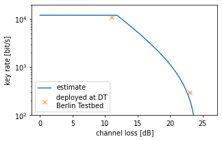

# QKD basics

Quantum Key Distribution [ref review] generates a random string for two players Alice and Bob. 
Physics guarantees that under some assumptions an evesdropper Eve cannot know anything about that string. 
The security of QKD can be formally proven [ref Tomamichel_2017]. 
However, any actual implementation of QKD is vulnerable to attacks that exploit imperfections such as information leakage into side channels. 
Proper security analysis and countermeasures against known attacks are thus also part of a QKD system. 

Even though an actual system is never fully secure, it is important to understand that QKD provides hardware-based security as apposed to computational security. 
QKD thus perfectly complements classical crypto and post-quantum crypto. 

Standardization is an important and ongoing process for QKD systems. There are the ETSI GS QKD 016 common criteria for prepare and measure QKD modules, among other documents... 

QKD networks can be logically organized in layers. For example in [openqkdnetwork.net](https://openqkdnetwork.net) there is the hosts layer for the application, the key management layer to manage QKD keys, the quantum network layer to control the routing and finally the quantum link layer with the physical devices. In a good design, all layers are fairly independent of one another. The QKD system we present here is the physcial device in the quantum link layer. 

From a user perspective, the performance of a QKD system is measured by its keyrate. It depends on only a few physical parameters. 
Understanding those simplifies network considerations by a lot. 
The most important factor is the loss in the fiber. The probability of detection decreases exponentially with the fiber length. 
The final keyrate is proportional to the repetition rate at Alice and the probability of detection. 
The second parameter is the qubit error rate: the probability to measure the wrong result at Bob. These errors need to be corrected and the information leakage during both the generation and correction of the errors compensated. This is called privacy amplification and compresses the key. There is a threshold above which no key generation is possible. 
The third factor are finite size effects, which become dominant for small block sizes. Therefore one has to wait for a reasonably sized block to be completed before obtaining the first key. 

Below we show an estimation of the keyrate vs channel loss. There is a maximum detector count rate, limiting the keyrate at low losses. There is an exponential decrease at medium loss and finally a drop off due to dark counts, which increase the qber.

