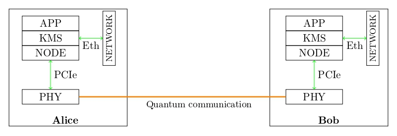

# The QKD System
## QKD basics

Quantum Key Distribution [ref review] generates a random string for two players Alice and Bob. 
Physics guarantees that under some assumptions an evesdropper Eve cannot know anything about that string. 
The security of QKD can be formally proven [ref Tomamichel_2017]. 
However, any actual implementation of QKD is vulnerable to attacks that exploit imperfections such as information leakage into side channels. 
Proper security analysis and countermeasures against known attacks are thus also part of a QKD system. 

Even though an actual system is never fully secure, it is important to understand that QKD provides hardware-based security as apposed to computational security. 
QKD thus perfectly complements classical crypto and post-quantum crypto. 

Standardization is an important and ongoing process for QKD systems. There are the ETSI GS QKD 016 common criteria for prepare and measure QKD modules, among other documents... 

QKD networks can be logically organized in layers. For example in [openqkdnetwork.net](https://openqkdnetwork.net) there is the hosts layer for the application, the key management layer to manage QKD keys, the quantum network layer to control the routing and finally the quantum link layer with the physical devices. In a good design, all layers are fairly independent of one another. The QKD system we present here is the physcial device in the quantum link layer. 

From a user perspective, the performance of a QKD system is measured by its keyrate. It depends on only a few physical parameters. 
Understanding those simplifies network considerations by a lot. 
The most important factor is the loss in the fiber. The probability of detection decreases exponentially with the fiber length. 
The final keyrate is proportional to the repetition rate at Alice and the probability of detection. 
The second parameter is the qubit error rate: the probability to measure the wrong result at Bob. These errors need to be corrected and the information leakage during both the generation and correction of the errors compensated. This is called privacy amplification and compresses the key. There is a threshold above which no key generation is possible. 
The third factor are finite size effects, which become dominant for small block sizes. Therefore one has to wait for a reasonably sized block to be completed before obtaining the first key. 

## PM-QKD

Prepare and Measure protocol (PM-QKD) includes a QKD transmitter party Alice and a QKD receiver party Bob. Alice prepares and sends quantum states to Bob through a quantum channel. Bob measures the quantum states. The result (after post-processing) is a common final key available to Alice and Bob.

## Our approach

We try to adopt a modular design. 
The heart of the system is the VQ Card performing real time digital processing and analog control. 
This card together with the PC, some electronics and the optics is in a rack mountable enclosure. 
The laser, detector, classical network and clock distribution is external. 
This way, development teams can use their own laser or detector to best suit their project. The protocol we run on the system is standard BB84 with time-bin encoding. 
Other protocols can be implemented but might require modifications of the FPGA code and other components. 

 

Our network philosophy is to separate the quantum and the classical network. Routing on the quantum network must be done with minimal optical losses. A typical loss budget of such a system is only 20dB. The classical communication can happen over any ethernet (with reasonable latency).

This is an overview of our open-source QKD system which provides a modular QKD architecture for current conventional communication systems. This architecture involves four layers (the physical hardware layer (PHY), the QKD Network Layer (Node), the key management service layer (KMS), the application layer). Each layer can be modified independently of the other ones for more flexibility. 
- The application layer consists of user devices and applications, which make key requests to the Key Management Service (KMS) layer. These devices and applications use these keys to encrypt data in a secure way. 
- The KMS layer obtains keys from the quantum network layer and distributes the keys to their designated hosts in  the application layer. The KMS layer must ensure the integrity and confidentiality of the keys.
- The Quantum Network Layer (Node): executes all the post-processing steps on the keys produced from the physical layer to get final secure keys. It coordinates key routing between nodes and provides the keys directly to the KMS layer. 
- The physical hardware layer (PHY) consists of the quantum channel and physical QKD hardware devices. These devices are responsable for generating the keys. After a key is produced, it is passed to Node where it is processed as described above. The PHY layer and Node share data through PCIe. 

