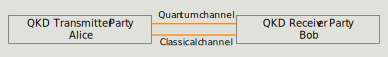
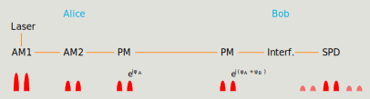
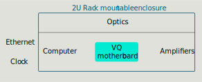
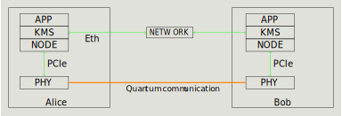

## PM-QKD

Prepare and Measure protocol (PM-QKD) includes a QKD transmitter party Alice and a QKD receiver party Bob. Alice prepares and sends quantum states to Bob through a quantum channel. Bob measures the quantum states. The result (after post-processing) is a common final key available to Alice and Bob.

## Time bin encoding

Alice uses a continuous wave laser, cuts out two pulses with an amplitude modulator and applies a differential phase to the two pulses. One of four phases is choosen randomly in BB84 fashion. Bob also applies a random phase, interferes the pulses using an umbalanced Mach-Zehnder interferometer and measures them on single-photon detector. More details are provided in the optics section.

For decoy state QKD the amplitude of the double pulse is chosen randomly from a small set. 

## Our technological approach

We adopt a modular design. 
The heart of the system is the VQ Card performing real time digital processing and analog control. 
This card together with the computer, some electronics and the optics is in a rack mountable enclosure. 
The classical network and clock distribution is external and must be provided for the system. 
The laser and detector are inside the encosure by default but can be made external for flexibility. 
This way, development teams can use their own laser or detector to best suit their project. The protocol we run on the system is standard BB84 with time-bin encoding. 
Other protocols can be implemented but might require modifications of the FPGA code and other components. 
The computer we use is a fairly powerful standard PC to leave room for custom postprocessing applications.

 

Our network philosophy is to separate the quantum and the classical network. The classical communication can happen over any ethernet connection. The reason behind this choice is that routing on the quantum network must be done with minimal optical losses. 
Coprapagation of the classical and the quantum signal on the same network inevitably increases the losses as well as the complexity. Nevertheless, shared networks are possible with proper filter designs. However, they depend strongly on the topologies and requirements of the operator. Such setups have not been tested with this system yet. 

This is an overview of the logical levels. This architecture involves four layers (the physical hardware layer (PHY), the QKD Network Layer (Node), the key management service layer (KMS), the application layer). Each layer can be modified independently of the other ones for more flexibility. 

- The application layer consists of user devices and applications, which make key requests to the Key Management Service (KMS) layer. These devices and applications use these keys to encrypt data in a secure way. 
- The KMS layer obtains keys from the quantum network layer and distributes the keys to their designated hosts in  the application layer. The KMS layer must ensure the integrity and confidentiality of the keys.
- The Quantum Network Layer (Node): executes all the post-processing steps on the keys produced from the physical layer to get final secure keys. It coordinates key routing between nodes and provides the keys directly to the KMS layer. 
- The physical hardware layer (PHY) consists of the quantum channel and physical QKD hardware devices. These devices are responsable for generating the keys. After a key is produced, it is passed to Node where it is processed as described above. The PHY layer and Node share data through PCIe. 

We make the physical hardware layer as well as Node open source. The KMS and applications remain closed source. 

## Post processing (done by Node)

For the BB84 protocol without decoy states, there are three steps to process the raw key into the final key:

- Sifting: the basis choice for each detection event is compared between Alice and Bob and the non-matching events are discarded.
- Error correction: mismatched bits are corrected using parity checks (via a low-density parity check code).
- Privacy amplification: the key is compressed to compensate information leakage (via Toeplitz hashing). The number of bits leaked in error correction is exactly known. The number of bits leaked to Eve on the quantum channel can be estimated by \\( h(\textrm{qber}) \\), where \\(h\\) is the binary entropy function. The qber here is the measured qber plus a few standard deviations to account for finite size statistics. 

## Classical network and external clock

The system requires two external clocks, 10MHz and 1PPS (pulse per second). The stability between Alice and Bob should be around 100ps on a timescales of around 100us. This is to ensure Bob can measure the pulses with a 100ps precision. Absolute timing stability is not important.

The system also requires a standard ethernet network (e.g. 1Gbit/s) for low-level communication and post processing. 

We use the [White Rabbit Switch](https://safran-navigation-timing.com/solution/white-rabbit-solutions/) to do both over a single optical channel. 

