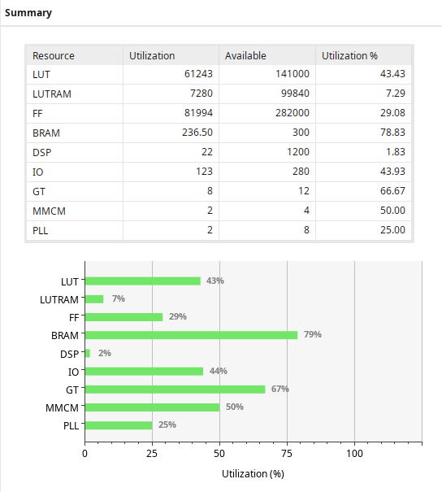
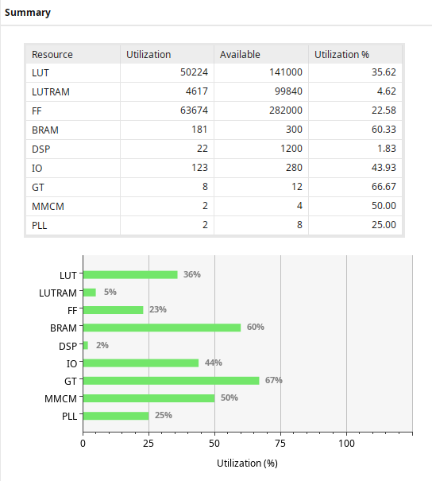
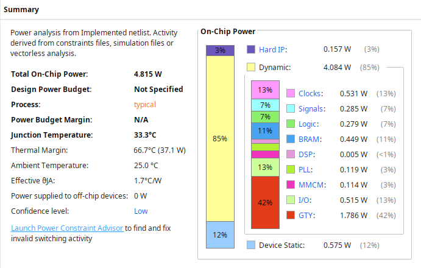

# Reports
From Vivado project, you can generate reports of design in detail. This text shows a summary of resource utilization and power consumption only, in case using ILA and not using ILA.

- Not using ILAs, the design saves a lot of resources(LUT, LUTRAM, FF and BRAM). So, the bitstream running on device will not include ILAs. For developper want to debug, keep it is useful.
- Either using ILAs or not, power consumption doesn't improve much, power confidence level is low. Currently it's not priority but possible to improve

## Report utilization summary
+ Design includes ILAs

+ Design without ILAs

## Report power summary
+ Design includes ILAs

+ Design without ILAs

