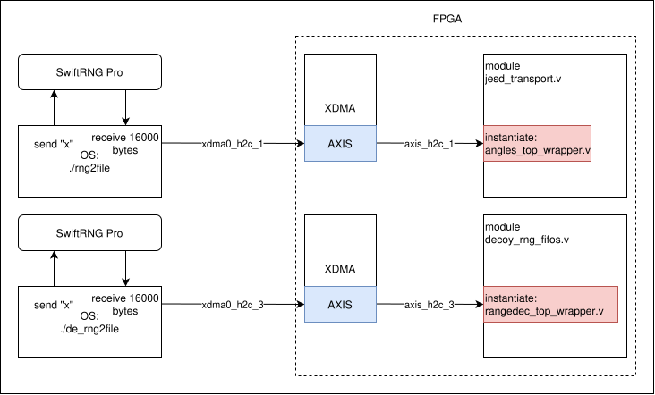

# True RNG
## tRNG

Picture below show you the path of random bytes. We have a small API sends "x" command to SwiftRNG Pro, the device returns 16000 bytes of random data. Then data is sent through PCIe to FPGA using axistream protocol.

There are 2 channels using true RNG data. One channel is for PM angles encoding in fastdac_transport.v and one channel is for AM angle encoding decoy state in decoy_rng_fifos.v 

## Modules RTL

- angles_top_wrapper.v
    - rangedec_top_wrapper.v : Implement range decoding with tunable distribution of bit 
        - fifo_up_wrapper.v
        - controller.v
        - basis_rangedec.v
        - fifo_uneven_1x2_wrapper.v
    - fifo_up_true_wrapper.v : fifo stores raw true RNG
    - bit_unpacker.v : unpack the data path to 2 bit output
