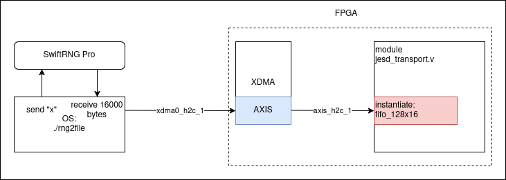

# RNG
To generate random number for QKD, we use SwiftRNG Pro from TectroLabs. [Documentation](https://tectrolabs.com/swiftrng-pro/) for device is available on website of TectroLabs.

Picture below show you the path of random bytes. We have a small API sends "x" command to SwiftRNG Pro, the device returns 16000 bytes of random data. Then data is sent through PCIe to FPGA using axistream protocol, jesd_transport.v manages to read data from axistream fifo fifo_128x16

