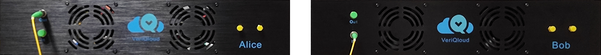

# Introduction

This documentation describes and explains the Quantum Key Distribution system developped by VeriQloud. 
This documentation is still under construction.

[Here is a datasheet](pics/kiwi_datasheet.pdf) of the system.

The source code can be found in the following repos

- [kiwi_pcb](https://github.com/Veriqloud/kiwi_pcb) (printed circuit boards)
- [kiwi_fpga](https://github.com/Veriqloud/kiwi_fpga) (fpga source code)
- [kiwi_hw_control](https://github.com/Veriqloud/kiwi_hw_control) (hardware control software; deployment; monitoring)

The above repos together with this documentation make up the hardware of the system. 
That should get you up to the raw key. 

Software on top of that, such as post processing, key management, QKD and non-QKD based applications can be made available on an individual basis. [Please contact us directly](https://veriqloud.com/contact/). 

